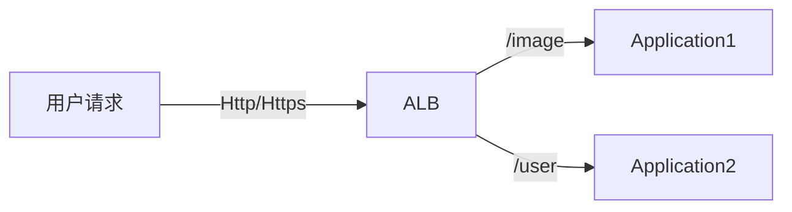

# 负载均衡

## 负载均衡的主要组成部分

1. 负载均衡的规则

负载均衡的规则决定了当用户请求到达时，以什么样的规则将请求转发到后面的部分实例中去

2. 负载均衡心跳包检测

负载均衡需要以一个固定的频率不停地向后方的实例发送心跳包，只有后方的实例在规定时间内答复心跳包，负载均衡才会将请求转发到实例中

## 负载均衡分类

从大类上看，负载均衡分为硬件和软件。

硬件负载均衡的性能极其优秀，但是价格也比较昂贵，同时难以进行动态扩容，因为需要扩容时需要购买相应的硬件。

基于软件的负载均衡是现在的主流，它在价格、扩容、易用性这几个方面取得了一个比较均衡的结果。基于软件的负载均衡又分为三个类别：

- DLB (DNS Load Balancer)
- ALB (Application Load Balancer)
- NLB (Network Load Balancer)

## 基于软件的负载均衡

### DLB

DNS 的主要功能是把域名解析称为 IP 地址。基于 DNS 的负载均衡的实现思路是：在域名解析的过程中，同一个域名可以解析称为不同实例的 IP 地址，这样用户的请求也就被分发到了不同的服务器上。

- 优点：配置简单
- 缺点：
	- 由于 DNS 缓存的存在，DNS 的生效具有延迟性
	- 不够灵活，DNS 支持的规则有限

DNS 通常作为第一层负载均衡，用于平衡不同区域请求数量的负载均衡。将请求均匀分发到距离用户最近的实例上 (北京用户分发到北京服务器、上海用户分发到上海服务器)。这种负载均衡和 CDN 很像。

### ALB

基于用户请求路径的不同，ALB 会把请求转发到不同的应用上。它可以作为配置后台，微服务之间请求转发的配置。

常见的 ALB 有：Nginx、HaProxy。由于 ALB 需要知道用户的请求路径，所以对于 Https 请求，ALB 需要从加密的信息中取出请求的路径，这意味着 ALB 需要管理证书。ALB 和后端的 Application 之间的通信通常是不经过加密的了 (也可以加密)。

- 优点：可以将请求负载均衡到**不同类型**的服务上

### NLB

与工作在应用层的 ALB 不同，NLB 工作在传输层。大致流程如下：

用户的请求首先会发送到一个虚拟 IP 地址 (Virtual IP)，NLB 在接收到请求之后会把目的 IP 地址进行转换 (DNAT)，经过转换后，目的 IP 地址就是一个后端实例的 IP 地址了，它通常是一个私有的 LAN 中的 IP 地址，对外是不可见的；在后端的服务器完成请求，发送响应时，也会经过 NLB 进行一次源 IP 地址转换 (SNAT)。

NLB 的性能比 ALB 高，因为它不涉及到解密数据包查看请求路径这一过程；但是它的灵活性比 ALB 差，无法根据请求路径进行负载均衡。

## 负载均衡总体结构

一个完整的架构大致如下：

1. 请求首先经过 DLB 分发到不同区域的数据中心中
2. 在数据中心中，请求经过 ALB 分发到不同的集群中
3. 在集群中，请求经过 NLB 分发给不同的服务器实例

在实际的架构中，ALB 和 NLB 谁先谁后并不固定，有的架构中是 NLB 在前，ALB 在后。
