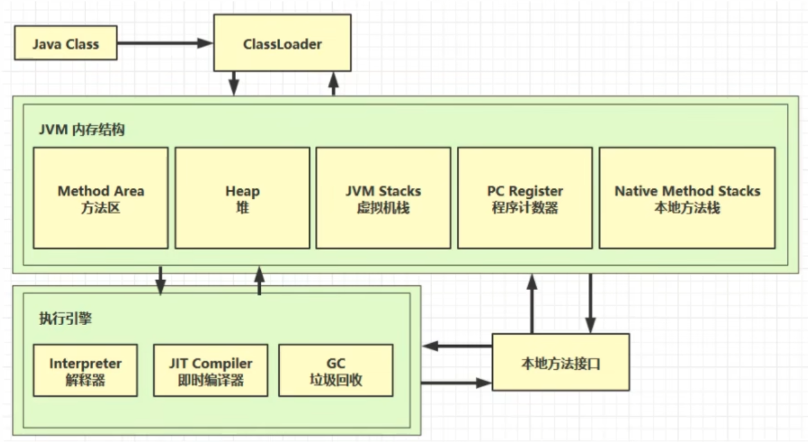
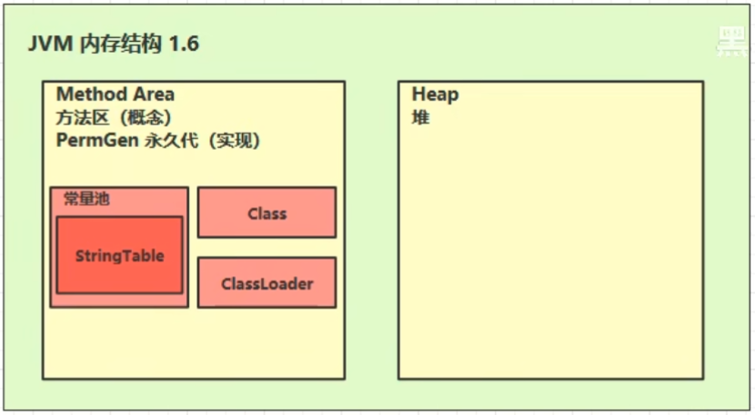
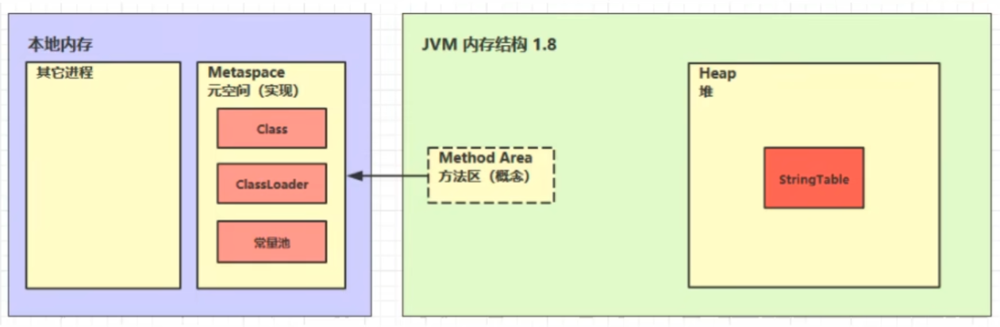
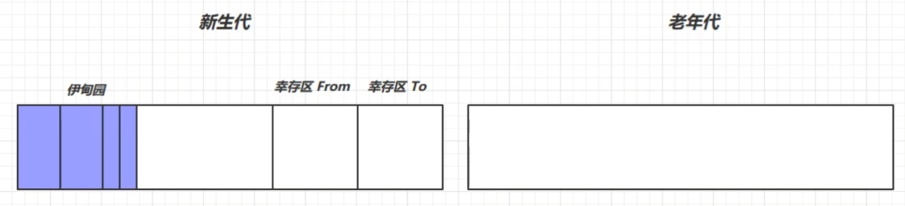
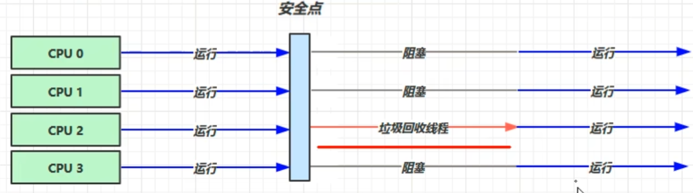
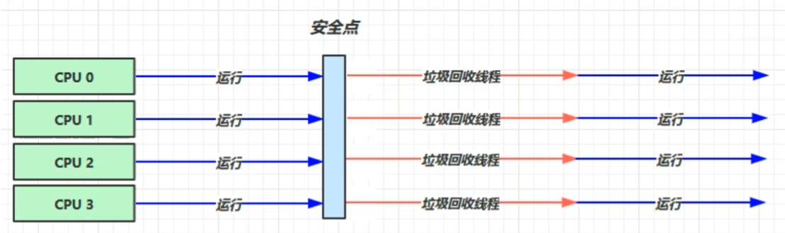
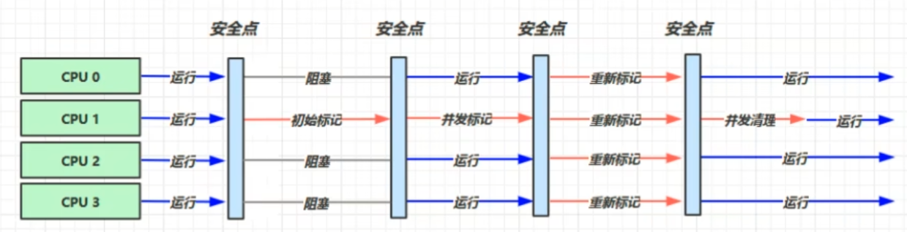

# JVM

JRE = JVM + 基础类库

JDK = JVM + 基础类库 + 编译工具



## 1. JVM 的内存结构

### 1.1 程序计数器

Java 代码编译和解释的流程：

```text
Java 源代码 -> JVM 指令 --解释器--> 机器码
```

程序计数器会指向下一条 JVM 指令的地址。程序计数器是线程私有的，在线程切换的时候，需要保存程序计数器的值。同时，程序计数器是不会内存溢出的。

### 1.2 虚拟机栈

当调用方法时，就会产生一个栈帧，然后将其压入栈内。栈帧内保存方法的相关信息，例如参数，返回值等。

可以用 `-Xss` 参数指定栈的大小，默认为 `1024KB`。栈并不是越大越好，因为**栈是属于线程**的，如果栈设置的过大，那么线程的开销就会过大，同时可以运行的线程也就越少。

一个线程对应一个栈，线程每次的方法调用都会产生一个栈帧。所以局部变量是不会有多线程并发问题的。

#### CPU 占用过高

1. 用 top 指令，定位哪个进程对 CPU 的占用过高
2. 用 ps -ef | grep xxx 定位哪个线程对 CPU 的占用过高
3. 用 jstack <进程 ID> 定位 Java 线程

#### 程序运行时间长

可以使用 jstack 检查是否发生死锁

### 1.3 本地方法栈

当 JVM 调用**本地方法**时，所使用的方法栈。本地方法就是非 Java 代码编写的方法，通常是操作系统底层 (C/C++) 方法。

### 1.4 堆

堆 (Heap) 是线程共享的，使用 `new` 关键字创建的对象都会存放在堆中。并且由于堆是线程共享的，所以堆中的对象需要考虑线程安全的问题。

堆的另一个重要机制就是**垃圾回收机制**。可以通过 `-Xmx` 来控制堆的大小。

#### 堆内存诊断工具

1. Jps 工具

查看当前系统中的 Java 进程

2. JMap 工具

查看堆内存占用情况 (-heap 参数)

3. JConsole 工具

提供可视化图形界面以及多种功能，可以连续查看堆内存的占用情况

### 1.5 方法区

方法区主要存储和类相关的信息，例如成员变量、成员方法、方法代码、构造函数等。

方法区在 JVM 启动的时候，会被创建。

方法区的组成如下：





### 1.6 运行时常量池

常量池就是一张表，虚拟机指令根据这张表去寻找需要的类名、方法名、参数类型、字符串等信息。常量池可以在 `.class` 文件中查看到，当这个类被加载时，它的常量表就会加入到运行时常量池中。

#### StringTable

串池 (StringTable)，是 JVM 为了节约空间而有的一个结构，其中存放的是 String 对象。在执行 `String a1 = "abc"` 这行代码时，首先会检查串池中是否已经有 `"abc"`，如果有则直接复用这个对象 (因为 `"abc"` 是常量)，否则将 `"abc"` 加入 StringTable，然后赋值给 `a1`。

```java
String a1 = "a"; // 加入 StringTable
String b1 = "b"; // 加入 StringTable
String c0 = "ab"; // 加入 StringTable
String c1 = a1 + b1; // 底层: String c1 = new StringBuilder().append(a1).append(b1) = new String("ab");
String c2 = "a" + "b"; // 编译期优化 String c2 = "ab";
```

在上面的例子中 `c1 != c0` 而 `c0 == c2`。

- `String.intern()` 在 1.8 之后会把 String 对象尝试放入 StringTable 中，并返回 StringTable 中的对象；在 1.6 中会尝试放入 String 对象的**副本**

StringTable 也是会被垃圾回收的。

### 1.7 直接内存 (系统内存)

## 2. 垃圾回收机制

### 2.1 如何判断对象是否可以被回收

有两种主要的判断方法：

1. 引用计数法
2. 可达性分析 (JVM)

引用计数法通过统一一个对象的引用次数是否为 0，来判断它能否被回收。不过如果出现了循环引用，则需要做额外处理。

可达性分析则是：

- 扫描堆中的对象，看看是否能够沿着 GC Root 对象作为起点通过引用链找到该对象
	- 如果可以找到，说明不可以被回收；反之，可以
- GC Root 指的是那些一定不会被回收的对象

#### 哪些对象可以作为 GC Root 对象

1. 当前活动线程中的局部变量
2. 本地方法栈
3. 被加锁的对象
4. System Class

#### 五种引用

1. 强引用
	- 只有所有的 GC Root 对象都不通过强引用引用该对象，该对象才会被垃圾回收
2. 软引用
	- 没有强引用引用该对象时，只有软引用引用该对象时，该对象会在内存不足时 (进行一次垃圾回收失败后) 被释放
3. 弱引用
	- 与软引用类似，区别在于不管内容状况如何，只要进行垃圾回收，都会回收该对象
4. 虚引用
	- 必须配合引用队列使用，主要作用与 ByteBuffer，当引用对象被回收时，会将虚引用入队，由一个专门的线程调用虚引用对象的相关方法进行内存释放
5. 终结器引用
	- 垃圾回收时，终结器引用入队但是不会回收对象，之后会由一个专门的线程调用终结器引用对象中的相关方法去进行对象资源的释放

### 2.2 垃圾回收算法

#### 标记-清除算法

标记-清除算法分为两个阶段：

1. 标记阶段：标记所有需要回收的对象
2. 清除阶段：清除所有被标记的对象

优点：速度快
缺点：容易产生内存碎片

#### 标记-整理算法

标记-整理算法分为两个阶段：

1. 标记阶段：标记所有需要回收的对象
2. 整理阶段：将存活的对象向一端移动，清除另一端的内存，让内存更加紧凑

优点：没有外部内存碎片
缺点：速度慢，整理的开销大

#### 复制算法

复制算法把内存划分为大小相等了两个区域 From 和 To，其中 To 区域始终是空闲的。

复制算法会把 From 区域的存活对象复制到 To 区域中，复制的时候会进行内存紧凑。复制完成之后，清空 From 区域，然后交换 From 和 To 的标签 (指针)。

优点：没有内存碎片，速度适中
缺点：内存开销大，需要消耗双倍的空间

### 2.3 分代回收机制



老年代主要存放长生命周期的对象，新生代主要存放短生命周期的对象。

- 当创建一个新对象时，首先会被放入 Eden 区域中
- 当 Eden 区域放不下新创建的对象时，会进行 Minor GC，此时采用复制算法，把幸存的对象幸存区 To 中，同时幸存对象会有一个年龄计数器 + 1
	- 如果此时幸存区也放不下了，则会提前晋升到老年代
- 过了一段时间，如果 Eden 区域又放不下新创建的对象了，还是会采用复制算法，对整个**新生代**进行垃圾回收。
- 当幸存对象的年龄计数器达到一定值 (例如 15) 时，就会被放入老年代中
- 当老年代也放不下对象时，此时会进行 Full GC，对整个堆 (新生代 + 老年代) 进行垃圾回收
	- 通常是新生代空间不足，然后进行了 Minor GC 之后，空间还是不足，这个时候将对象放入老年代，发现老年代也放不下，才会进行 Full GC。所以在进行 Full GC 之前，通常会进行一次 Minor GC

Minor GC 会导致 STW (Stop The World)，即暂停所有的线程，进行垃圾回收，不过通常时间比较短。
Full GC 也会导致 STW，并且时间比 Minor GC 更长。

### 2.4 垃圾回收器

#### 串行

串行垃圾回收器是单线程的，适合堆内存比较小和个人电脑使用

```shell
-XX:+UseSerialGC (= Serial[新生代 复制算法] + SerialOld[老年代 标记整理])
```

使用 `-XX:+UseSerialGC` 开启串行垃圾回收。



#### 吞吐量优先

吞吐量优先的垃圾回收器是多线程的，适合堆内存较大的场景需求多核 CPU 的支持。适合工作在服务器上。

吞吐量优先会尽可能地让单位时间内 STW 时间更短。(例如 一个小时内 STW 的时间为 0.5s，单位时间内的 STW 时间更短，但是可能只发生一次，这一次的 STW 时间比响应时间优先的垃圾回收器长)

```shell
-XX:+UseParallelGC ~ -XX:UseParallelOldGC
```



通常，垃圾回收线程数与 CPU 核数相等，在发生 GC 时，CPU 占用会飙升。

#### 响应时间优先 (CMS，标记清除算法)

响应时间优先的垃圾回收器是多线程的，适合堆内存较大的场景需求多核 CPU 的支持。适合工作在服务器上。

响应时间优先会尽可能地让 STW 的时间更短。(例如 一个小时内发生多次时间为 0.2s 的 STW，单次 STW 时间更短，但是此时不一定更少)

```shell
-XX:+UseConcMarkSweepGC [工作在老年代]
-XX:+UseParNewGC [工作在新生代] 并发失败 -> -XX: SerialOld
```



当老年代空间不足时 (各个线程到达第一个安全点)，此时要进行初始标记 (存在 STW，但是很快，因为它只标记和根对象相关联的对象)，在初始标记完成之后，然后开始并发标记 (不存在 STW)，再然后进行重新标记 (存在 STW，主要标记并发标记阶段新的需要清理的对象)，最后进行并发清理。

在并发清理时，也会产生新的垃圾 (浮动垃圾)，所以如果在内存不足时才进行 CMS 垃圾回收可能已经来不及了，需要设置专门设置一个参数来指定老年代内存占比达到多少时，就启动 CMS。