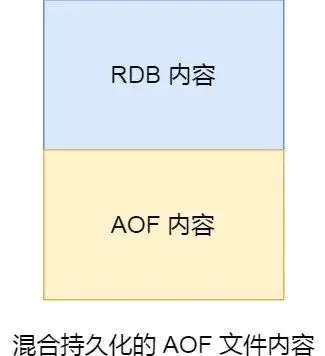
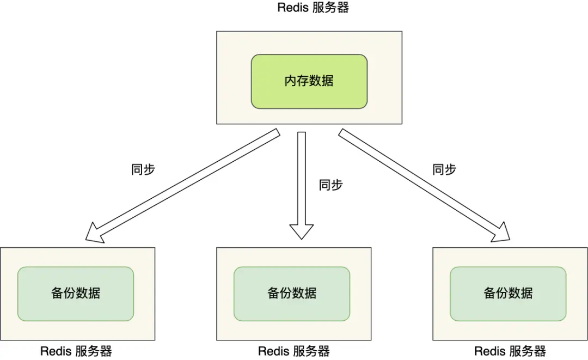

# Redis

## Redis 基本类型

### String


String 类型的底层实现主要是 `int` 和 `SDS`。

SDS (简单动态字符串)，它的特点如下: 

- SDS 不仅可以保存文本数据，还可以保存二进制数据。SDS 使用 `len` 属性的值而不是空字符串来判断字符串的结束位置，并且 SDS 的所有 API 都会以处理二进制的方式来处理 SDS 存放在 `buf[]` 数组里的数据
- SDS 获取字符串长度的时间复杂度是 `O(1)`
- SDS API 是安全的，拼接字符串不会造成缓冲区溢出

#### 数据结构

SDS 内部的编码有三种：`int`、`raw` 和 `emstr`。

- 如果一个字符串保存的值是整数，并且这个数可以用 `long` 来表示，那么 SDS 会将这个整数编码成 `int` 类型，保存在字符串对象结构的 `ptr` 属性中。


- 如果字符串对象保存的是一个字符串，并且这个字符串的长度小于 `32` (这个值在不同的 Redis 版本中是不同的) 字节，那么 SDS 会将这个字符串编码成 `emstr` 类型，保存在字符串对象结构的 `ptr` 属性中。


- 如果字符串对象保存的是一个字符串，并且这个字符串的长度大于 `32` 字节，那么 SDS 会将这个字符串编码成 `raw` 类型，保存在字符串对象结构的 `ptr` 属性中。


`emstr` 和 `raw` 都会使用 SDS 来保存字符串，但是对于 `emstr` 来说，它会通过一次内存分配来获得 `redisObject` 和 SDS 的内存空间，而 `raw` 则会进行两次分配

#### 应用场景

- 分布式锁
	- `SET` 命令有一个 `NX` 参数可以实现分布式锁
		- 如果 key 不存在，则设置成功，表示加锁成功
		- 如果 key 存在，则设置失败，表示加锁失败
	- `SET` 命令有一个 `PX` 参数可以设置过期时间，与 `NX` 配合使用实现分布式锁

```redis
SET lock_key unique_value NX PX 10000
```

在解锁时，需要先判断锁是否存在 (锁过期后会被删除) 以及锁是否是自己的 (锁过期被删除后又被其他线程设置了锁)，如果是自己的锁，则可以删除锁。解锁有判断和解锁两个操作，为了保证原子性，可以使用 `lua` 脚本来实现。

---

- 共享 Session 信息

在单系统应用中，通常会使用 Session 来保存用户信息，但是在分布式系统上，这种方法不再适用。例如，用户 A 第一次访问时，它的信息被保存到服务器一上，但是第二次访问时用户 A 不一定被分配到服务器一，如果用户 A 被分配到了其他服务器，那么就需要重新登录。


为了避免这种情况，可以使用 Redis 来保存用户的 Session 信息。每次用户登录时，都会将用户的信息保存到 Redis 中，并且在每次请求时都会从 Redis 中获取用户的信息。这样就可以实现跨服务器的 Session 共享。

### List


#### 数据结构

#### 应用场景

- 消息队列

消息队列在存取消息时，必须要满足三个需求，分别是**消息保序、处理重复的消息和保证消息可靠性**。

1. 消息保序
	- List 本身就是按照先进先出的顺序对数据进行存储的，如果使用 List 作为消息队列，那么天然就可以保证消息的顺序性。
	- 使用 `LPUSH + RPOP` 或者 `RPUSH + LPOP` 实现消息队列
	- 在生产者向消息队列中写入数据时，Redis 并不会主动通知消费者，此时消费者需要不停地调用 `RPOP` 指令去空转取数据，这样会造成 CPU 的空转，浪费性能。
		- 为了解决这个问题，Redis 中可以使用 `BRPOP` 指令来实现阻塞式的取数据，`BRPOP` 指令会在 List 中没有数据时阻塞等待，直到有数据写入 List 中时才会返回数据。
2. 处理重复消息
	- 每个消息都需要有独立的 ID
	- 消费者需要记录已经处理过的 ID
3. 保证消息的可靠性
	- 当消费者从 List 中取出一条消息进行处理后，List 就不会再保留这条消息了，如果消费者程序发生了故障，那么这条消息就丢失了。
		- 为了解决这个问题，可以使用 `BRPOPLPUSH` 命令来实现消息的可靠性，它的作用是：在消费者从 List 中取出一条消息的同时，将这条消息放入一个新的 List 中，这样就可以保证消息的可靠性。

基于 List 实现的消息队列不支持多个消费者消费同一条消息。

### Hash

#### 数据结构

#### 应用场景

- 缓存对象

Hash 中的 (Key-Field-Value) 与对象的结构 (Id-Prop-Value) 类似，可以用来存储对象。例如，对于下面的用户信息来说：

| uid | name  | age |
| --- | ----- | --- |
| 1   | Jack  | 15  |
| 2   | Jerry | 16  |

```redis
HMSET uid:1 name Jack age 15
HMSET uid:2 name Jerry age 16
```

事实上，对于缓存对象来说，通常有两种选择：

1. 使用 Hash 缓存对象
2. 使用 String + Json 缓存对象

对于一般的对象可以使用 String + Json 的方式进行缓存，而对于一些属性频繁变化的对象则可以使用 Hash 的方式进行缓存。

---

- 购物车

以用户 id 为 key，商品 id 为 field，商品数量为 value，刚好可以使用 Hash 来存储。

### Set

#### 数据结构

#### 应用场景

Set 的特点是：无序、不可重复、支持集合运算。因此 Set 类型比较适合用来进行数据去重、保障数据唯一性，以及进行集合运算。Set 做集合运算时，时间复杂度较高，在数据量较大的时候，容易操作阻塞。通常是构建主从集群，将主库的 Set 数据同步到从库上，然后在从库上进行集合运算。这样可以避免主库的阻塞。

- 点赞服务

Set 可以保证每个用户只能点一个赞，其中 Key 可以是文章 id，Field 可以是用户 id。

```shell
SADD article:1 user:1
SADD article:1 user:2
# 取消点赞
SREM article:1 user:1
# 获取点赞的用户
SMEMBERS article:1
# 获取点赞的数量
SCARD article:1
```

- 共同关注/好友

通过集合交集运算来获取两个用户的共同关注/好友。

### ZSet

#### 数据结构

#### 应用场景

- 排行榜

```shell
# article1 获得了 100 点赞
ZADD user:1:ranking 100 article:1
# article2 获得了 50 点赞
ZADD user:1:ranking 50 article:2
# article3 获得了 80 点赞
ZADD user:1:ranking 80 article:3
# 获取点赞数最高的两篇文章
ZREVRANGE user:1:ranking 0 1 WITHSCORES
# 获取点赞数 100 到 200 的文章
ZRANGEBYSCORE user:1:ranking 100 200 WITHSCORES
```

## Redis 数据结构


上图是 Redis 的大致结构，整个 Redis 由哈希表构成，其中，哈希表中的值根据类型不同由不同的对象结构来表示。

### SDS (简单动态字符串)

SDS 的目的是为了解决 C 语言字符串中的几个不足之处：

1. C 语言字符串是一个字符数组，以 `\0` 表示字符串的结束，在调用 `strlen()` 函数时，需要遍历整个字符数组直到找到 `\0`，它的时间复杂度是 O(n)
2. 由于 C 语言字符串以 `\0` 标记字符串结束，所以如果中间出现了 `\0` 那么就会截断字符串，这意味着 C 语言字符串只能存放字符串，无法存放二进制数据，例如图片、视频等
3. C 语言字符串的操作函数是内存不安全的，容易导致缓冲区溢出，在调用 `strcat()` 函数时，需要保证目标字符串的长度足够大，否则就会出现缓冲区溢出的问题


- SDS 引入了 `len` 表示字符串的长度，使得获取字符串长度的时间复杂度为 O(1)。
- `alloc` 表示分配的内存大小。在修改字符串时，可以通过 `alloc - len` 快速判断是否需要扩容。

由于 SDS 使用 `len` 来判断字符串的结束，所以它不会以 `\0` 来作为字符串结束标志 (为了兼容 C 语言字符串，SDS 还是会在末尾加上 `\0`)，所以 SDS 支持存放二进制数据。同时由于可以通过 `alloc` 和 `len` 快速判断是否需要扩容，所以 SDS 的操作函数是内存安全的。

SDS 的扩容机制如下，假设 `needLen` 表示 SDS 至少需要的长度：

- 若 `needLen < 1MB`，则扩容为 `2 * needLen`
- 若 `needLen >= 1MB`，则扩容为 `needLen + 1MB`

最后，SDS 还有一个 `flags` 字段，它表示 SDS 的类型。Redis 中一共有 5 中 SDS 类型：sdshdr5、sdshdr8、sdshdr16、sdshdr32 和 sdshdr64。它们的区别主要在于 SDS 数据结构中 `len` 和 `alloc` 的数据类型不同。例如对于 sdshdr16 和 sdshdr32：

```c
struct __attribute__ ((__packed__)) sdshdr16 {
		uint16_t len; // 字符串长度
		uint16_t alloc; // 分配的内存大小
		unsigned char flags; // SDS 类型
		char buf[]; // 字符串内容
};
struct __attribute__ ((__packed__)) sdshdr32 {
		uint32_t len; // 字符串长度
		uint32_t alloc; // 分配的内存大小
		unsigned char flags; // SDS 类型
		char buf[]; // 字符串内容
};
```

sdshdr16 类型的 `len` 和 `alloc` 的数据类型都是 `uint16_t`，这限定了它们的取值范围。sdshdr32 也是一样的。`__attribute__ ((__packed__))` 是为了禁用编译器的内存对齐功能，避免内存浪费。

### 双向链表


上图是双向链表的结构，其中 `dup` 表示复制函数，`free` 表示释放函数，`match` 表示节点比较函数。

- 优点
	- 头插和尾插的时间复杂度为 O(1)
	- 通过 len 可以快速获取链表的长度
- 缺点
	- 无法利用到缓存
	- 内存占用较大，因为每个值都需要存储两个指针

在 Redis 3.0 中，双向链表是 List 的底层数据结构之一，在之后的 Redis 新版本中，List 的底层数据结构被替换为 quicklist。

### 压缩列表 (ZipList)

在 Redis 3.0 中，当 List 中的数据对象较少时，会采用 ZipList 来作为 List 的底层数据结构。


- 优点
	- 空间连续，可以利用到缓存来加速访问速度。
- 缺点
	- 不能保存过多的元素，否则会降低查询效率
	- 新增或者修改某个元素时，可能需要重新分配整个压缩列表的空间，引发连锁更新的问题

压缩列表的字段解释如下：

- zlbytes: 压缩列表占用的总内存字节数
- zltail：压缩列表最后一个节点的内存偏移量
- zllen：压缩列表的节点数量
- zlend：压缩列表的结束标志，固定值 0xFF

可以看出压缩列表仍然保有链表的特点，可以很快地找到第一个元素和最后一个元素的位置，但是对于随机访问，它和链表一样都是 O(n) 的时间复杂度，因为压缩列表的节点 `entry` 的大小并不是固定的，一个 `entry` 包含有三个部分：

- prevlen：记录前一个 `entry` 的长度，方便逆序遍历
- encoding：记录当前 `entry` 的类型和长度，类型主要有两种，字符串和整数
- data：记录当期 `entry` 的数据，类型和长度取决于 `encoding`

#### 连锁更新

压缩列表除了查找的时间复杂度较高之外，还有一个问题就是连锁更新。前面提到，压缩列表的 `entry` 节点中 `prevlen` 记录着前一个 `entry` 节点的长度，为了节省空间，`prevlen` 本身所占用的空间是可变的：

- 如果前一个节点的长度**小于** 254 字节，那么 `prevlen` 属性需要用 **1 字节的空间**来保存这个长度值；
- 如果前一个节点的长度**大于等于** 254 字节，那么 `prevlen` 属性需要用 **5 个字节的空间**来保存这个长度

那么如果在进行头插/插入节点时，如果插入的节点长度大于等于 254 字节，那么该节点的下一个节点的 `prevlen` 可能就需要从 1 字节变成 5 字节，而如果这个节点的大小本来就很接近 254 字节，例如 252 字节，那么它在更新结束之后也会导致它的下一个节点更新 `prevlen`，从而产生连锁更新。

### 哈希表


在 Redis 中，`dictht` 对应一个哈希表的结构，而 `dict` 中定义了两个哈希表则是为了在 `rehash` 的时候使用。随着哈希表中元素的增多，哈希桶下挂载的链表长度也会越来越长，由于链表的查询时间复杂度是 O(n)，所以在 Redis 中会定期对哈希表进行 rehash 操作，rehash 的过程就是将哈希表中的元素重新分配到新的哈希表中。

#### Rehash

`rehash` 的步骤如下：

1. 给 哈希表2 分配空间，一般分配的空间是 哈希表1 的两倍
2. 将 哈希表1 中的元素重新分配到 哈希表2 中
3. 释放 哈希表1 的空间，当前的 哈希表2 就成为了 哈希表1，在以前的 哈希表2 处重新创建一个空白的哈希表，为下一次 rehash 做准备

#### 渐进式 Rehash

在 `rehash` 的第二个步骤中，如果 哈希表1 中的元素很多，那么在进行重新分配时，就会产生明显的阻塞，此时可能会导致 Redis 无法响应其他请求。为了避免这个问题，Redis 采用渐进式 `rehash`。

渐进式 `rehash` 的步骤如下：

1. 给 哈希表2 分配空间，一般分配的空间是 哈希表1 的两倍
2. 不主动地将 哈希表1 中的元素重新分配到 哈希表2 中，而是每次有请求到来，使得哈希表进行新增、删除、查找、更新操作时，除了响应请求外，还把 哈希表1 中对应位置上的元素移动到 哈希表2 中
3. 当 哈希表1 中的元素全部移动到 哈希表2 中时，释放 哈希表1 的空间，当前的 哈希表2 就成为了 哈希表1，在以前的 哈希表2 处重新创建一个空白的哈希表，为下一次 rehash 做准备

在渐进式 `rehash` 的过程中，如果在 哈希表1 中没有找到元素，则还会到 哈希表2 中去寻找。

#### Rehash 的触发条件

$$
负载因子 (Load\_Factor) = \frac{哈希表已经保存的元素个数}{哈希表大小}
$$

- 当负载因子大于 1 时，就会**考虑**进行 Rehash。
- 当负载因子大于 5 时，就会**强制**进行 Rehash。

由于渐进式 `Rehash` 的存在，会对持久化操作 (BgSave 和 BgRewriteAof) 造成影响，所以当负载因子大于 1 时，如果没有进行持久化操作，那么就会进行 `rehash`；当负载因子大于 5 时，不管是不是在进行持久化操作，都会进行 `rehash`。

### 整数集合

整数集合是 Set 的底层实现之一。当一个 Set 中所有的元素都是整数，并且元素数量较少时，就会使用整数集合作为 Set 的底层实现。整数集合的结构如下：

```c
typedef struct intset {
	uint32_t encoding; // 编码方式
	uint32_t length; // 集合中元素的数量
	int8_t contents[]; // 集合中元素的值
} intset;
```

虽然 `contents` 被声明为 `int8_t` 数组类型，但是它实际的类型取决于 `encoding` 的值。例如：

- 如果 `encoding` 的值为 `INTSET_ENC_INT16`，那么 `contents` 的类型为 `int16_t`
- 如果 `encoding` 的值为 `INTSET_ENC_INT32`，那么 `contents` 的类型为 `int32_t`
- 如果 `encoding` 的值为 `INTSET_ENC_INT64`，那么 `contents` 的类型为 `int64_t`

#### 整数集合的升级

当一个新的元素加入到整数集合中时，如果新的元素的类型 (int32_t) 比整数集合现有的所有元素的类型 (int16_t) 都要大时，整数集合就会进行升级，也就是按照新的元素的类型 (int32_t) 来重新分配空间。


### 跳表

Redis 中只有 ZSet 用到了跳表，跳表的优势是能支持平均 O(logN) 复杂度的节点查找。ZSet 结构体里有两个数据结构：一个是跳表，一个是哈希表。这样的好处是既能进行高效的范围查询，也能进行高效单点查询。

```c
typedef struct zset {
    dict *dict;
    zskiplist *zsl;
} zset;
```

```c
typedef struct zskiplistNode {
    //Zset 对象的元素值
    sds ele;
    //元素权重值
    double score;
    //后向指针
    struct zskiplistNode *backward;
  
    //节点的level数组，保存每层上的前向指针和跨度
    struct zskiplistLevel {
        struct zskiplistNode *forward;
        # span 表示当前节点 A 到下一个节点 B 的跨度 (在 Level 1 时，A 距离 B 多少个节点)
        unsigned long span;
    } level[];
} zskiplistNode;
```


链表的查询时间复杂度是 O(n)，插入时间复杂度是 O(1)；数组的查询时间复杂度 (二分查找) 是 O(logn)，插入时间复杂度是 O(n)。现在需要一个数据结构能够结合它们的优点，我们可以采用平衡二叉搜索树，但是它的实现比较复杂，所以 Redis 采用了跳表。

一个完美的跳表在下标为 2 的倍数的节点上 Level 会加 1，在下标为 4 的倍数的节点上 Level 会加 2，在下标为 8 的倍数的节点上 Level 会加 3，以此类推。这样就可以保证每一层的节点数是前一层的一半。

但是由于要进行增删节点的操作，维持一个完美的跳表是很复杂的，所以实现跳表时通常采用随机化来决定一个节点的 Level。在插入一个新节点时，Level 的初始值为 1，抛一枚硬币，如果为正面则 Level + 1，并继续这个过程，如果抛出反面，则停止这个过程。

### quicklist

在 Redis 3.0 之前，List 对象的底层数据结构是双向链表或者压缩列表。然后在 Redis 3.2 的时候，List 对象的底层改由 quicklist 数据结构实现。

其实 quicklist 就是「双向链表 + 压缩列表」组合，因为一个 quicklist 就是一个链表，而链表中的每个元素又是一个压缩列表。


压缩列表的主要缺点是连锁更新问题，而 quicklist 中的每个 quicklistNode 中的压缩列表的长度是受到限制的，这样在连锁更新时就不会造成太大的损耗了。

```c
typedef struct quicklist {
    //quicklist的链表头
    quicklistNode *head;      //quicklist的链表头
    //quicklist的链表尾
    quicklistNode *tail; 
    //所有压缩列表中的总元素个数
    unsigned long count;
    //quicklistNodes的个数
    unsigned long len;       
    ...
} quicklist;

typedef struct quicklistNode {
    //前一个quicklistNode
    struct quicklistNode *prev;     //前一个quicklistNode
    //下一个quicklistNode
    struct quicklistNode *next;     //后一个quicklistNode
    //quicklistNode指向的压缩列表
    unsigned char *zl;              
    //压缩列表的的字节大小
    unsigned int sz;                
    //压缩列表的元素个数
    unsigned int count : 16;        //ziplist中的元素个数 
    ....
} quicklistNode;
```

quicklist 并没有解决连锁更新的问题，只是降低了连锁更新的开销，并且 quicklist 的随机访问的时间复杂度仍然是 O(n)。

### listpack

Redis 在 5.0 新设计一个数据结构叫 listpack，目的是替代压缩列表，它最大特点是 listpack 中每个节点不再包含前一个节点的长度了，压缩列表每个节点正因为需要保存前一个节点的长度字段，就会有连锁更新的隐患。


- encoding 定义该元素的编码类型，会对不同长度的整数和字符串进行编码
- data 表示实际存放的数据
- len encoding + data 的总长度

ziplist 中 prevlen 是为了逆序遍历，在 listpack 中，prevlen 变成了 len，不过还是可以进行逆序遍历。可以参考[源码中的 lpDecodeBacklen 函数](https://github.com/antirez/listpack/blob/master/listpack.c)。

## AOF 持久化

如果 Redis 每执行一条命令，就把这个命令以追加 (Append) 的方式写入到磁盘中，然后下一次打开 Redis 时，先去这个文件中读取命令，然后全部执行一遍，不就相当于把 Redis 的数据持久化到磁盘中了么？这样就可以实现 Redis 的持久化了。

这种保存数据的方式称为 AOF (Append Only File)，也就是追加文件。Redis 中的 AOF 文件是一个文本文件，里面保存的是 Redis 的命令 (只有写操作命令才会保存)。Redis 的 AOF 持久化功能默认是**不开启**的，需要修改 `redis.conf` 配置文件。

```conf
appendonly      yes
appendfilename "appendonly.aof""
```


- \*3 表示命令有三个部分，每个部分都会以 $ + 数字 的格式开头
- $ + 数字 其中的数字表示命令的长度

Redis 会在执行完写操作**之后**，将命令记录到 AOF 文件中，这么做的好处是如果写操作报错，则不会记录命令，减少资源的消耗；坏处则是：

- 如果 Redis 在执行完写操作之后宕机了，此时 AOF 文件中的记录就会与实际的不一致
- 可能会阻塞下一条命令的执行

### AOF 的写入时机


上面是 Redis 写入 AOF 的大致流程：

1. Redis 执行完写操作命令后，会将命令追加到 server.aof_buf 缓冲区；
2. 然后通过 write() 系统调用，将 aof_buf 缓冲区的数据写入到 AOF 文件，此时数据并没有写入到硬盘，而是拷贝到了内核缓冲区 page cache，等待内核将数据写入硬盘；
3. 具体内核缓冲区的数据什么时候写入到硬盘，由内核决定。

Redis 提供了 3 中写回策略，用于控制上面的三个流程，在 redis.conf 中的 appendfsync 配置项有三个值可以设置：

- Always，每次执行完写操作之后，都把命令记录到 AOF 文件中，执行写操作和记录命令是同步的。
- Everysec，每次写操作命令执行完后，先将命令写入到 AOF 文件的内核缓冲区，然后每隔一秒将缓冲区里的内容写回到硬盘，执行写操作之后，会异步启用一个定时器，定时器每隔一秒执行一次 fsync() 系统调用，将内核缓冲区的内容写回到硬盘。
- No，不由 Redis 控制写回硬盘的时机，转交给操作系统控制写回的时机，也就是每次写操作命令执行完后，先将命令写入到 AOF 文件的内核缓冲区，再由操作系统决定何时将缓冲区内容写回硬盘。

> 虽然说是把命令写入 AOF 文件的内核缓冲区，但其实还是先写入到 server.aof_buf，然后再调用 write() 写入到内核缓冲区，最后如果是 Always，则是调用 fsync() 将内核缓冲区的内容写入到硬盘；如果是 Everysec，则是每秒调用一次 fsync() 将内核缓冲区的内容写入到硬盘；如果是 No，则是交给操作系统决定何时将缓冲区内容写回硬盘。

- No -> 高性能，低可靠
- Everysec -> 性能和可靠性都不错
- Always -> 低性能，高可靠

### AOF 的重写

随着写命令的堆积，AOF 文件的大小会越来越大，Redis 提供了 AOF 的重写来解决这个问题，重写的流程如下：

1. 创建一个新的 AOF 文件
2. 遍历 Redis 数据库中的所有键值对
3. 将每个键值对转换为 SET 命令，加入到新的 AOF 文件中

重写主要是为了针对于前后执行了 `SET name A`，`SET name B` 这样的指令，在重写之后，`SET name A` 就不会被保留了。

#### 后台重写

写入 AOF 日志的操作虽然是在主进程完成的，因为它写入的内容不多，所以一般不太影响命令的操作。

但是在触发 AOF 重写时，比如当 AOF 文件大于 64M 时，就会对 AOF 文件进行重写，这时是需要读取所有缓存的键值对数据，并为每个键值对生成一条命令，然后将其写入到新的 AOF 文件，重写完后，就把现在的 AOF 文件替换掉。

这个过程其实是很耗时的，所以重写的操作不能放在主进程里。

所以 Redis 中的重写是由后台子进程 `bgrewriteaof` 完成的，其好处在于：

- 子进程进行 AOF 重写期间，主进程可以继续处理命令请求，从而避免阻塞主进程；
- 子进程带有主进程的数据副本

## RDB 快照

RDB 是 Redis 的另一种持久化方式，它会在指定的时间间隔内，将 Redis 的数据快照保存到硬盘中。

RDB 快照就是记录某一个瞬间的内存数据，记录的是实际数据，而 AOF 文件记录的是命令操作的日志，而不是实际的数据。

因此在 Redis 恢复数据时， RDB 恢复数据的效率会比 AOF 高些，因为直接将 RDB 文件读入内存就可以，不需要像 AOF 那样还需要额外执行操作命令的步骤才能恢复数据。

Redis 提供了两条指令来生成 RDB 快照，分别是 `save` 和 `bgsave`，他们的区别就在于是否在「主线程」里执行：

- 执行了 save 命令，就会在主线程生成 RDB 文件，由于和执行操作命令在同一个线程，所以如果写入 RDB 文件的时间太长，会阻塞主线程；
- 执行了 bgsave 命令，会创建一个子进程来生成 RDB 文件，这样可以避免主线程的阻塞；

Redis 还可以通过配置文件来实现每隔一段时间自动执行一次 bgsave 命令：

```conf
save 900 1
save 300 10
save 60 10000
```

虽然选项的名字叫做 save，但是其实它的作用是设置 bgsave 的时间间隔。上面的配置表示：

- 如果 900 秒内有 1 次写操作，就会执行 bgsave 命令
- 如果 300 秒内有 10 次写操作，就会执行 bgsave 命令
- 如果 60 秒内有 10000 次写操作，就会执行 bgsave 命令

满足其一就会执行 bgsave 命令。

RDB 快照会把数据库中的所有数据全部记录到磁盘中，所以这个操作是相当重的。通常至少 5 分钟才会执行一次快照，所以如果 Redis 出现宕机，RDB 快照会比 AOF 丢失的数据更多。

#### 写时复制

当执行 `bgsave` 时，主线程也是会修改数据的，如果不可以修改，那么就会造成严重的性能损耗。那么是如何实现主线程也可以修改数据的呢？关键就在于**写时复制**技术。

在执行 `bgsave` 时，会通过 `fork()` 创建一个子进程，此时子进程和父进程是共享同一片内存数据的，因为创建子进程的时候，会复制父进程的页表，但是页表指向的物理内存还是一个。


只有当共享内存中有数据被修改时，才会真正地复制一份新的内存出来，这就是写时复制 (Copy on Write) 技术。


这样做的目的是为了减少创建进程时的消耗，因为创建子进程时会阻塞父进程，如果直接复制父进程的内存数据并且内存数据较多的话，那么就会造成父进程的阻塞，影响性能。而如果只是复制父进程的页表，那么就会迅速很多了。

所以，创建 bgsave 子进程后，由于共享父进程的所有内存数据，于是就可以直接读取主线程（父进程）里的内存数据，并将数据写入到 RDB 文件。但是如果父进程修改了共享内存中的数据，此时这块的内存就会被复制一份，子进程继续保存原本的数据，父进程则在新的数据上进行操作。

从上面的流程可以看出来，在生成 RDB 时发生的新增和修改，是不会被记录到 RDB 中的，只能交给下一次 RDB 快照。

## RDB/AOF 混合持久化

当开启了混合持久化时，在 **AOF 重写日志**时，fork 出来的重写子进程会先将与主线程共享的内存数据以 **RDB** 方式写入到 **AOF** 文件，然后主线程处理的操作命令会被记录在重写缓冲区里，重写缓冲区里的增量命令会以 AOF 方式写入到 AOF 文件，写入完成后通知主进程将新的含有 RDB 格式和 AOF 格式的 AOF 文件替换旧的的 AOF 文件。

> 混合持久化主要修改的是 AOF 重写时的操作，而不是记录 AOF 日志时的操作，在记录的时候，仍然是以追加的方式写入到 AOF 文件末尾。



## Redis 过期删除策略

先说一下对 key 设置过期时间的命令。 设置 key 过期时间的命令一共有 4 个：

- expire \<key\> \<n\>：设置 key 在 n 秒后过期，比如 expire key 100 表示设置 key 在 100 秒后过期；
- pexpire \<key\> \<n\>：设置 key 在 n 毫秒后过期，比如 pexpire key2 100000 表示设置 key2 在 100000 毫秒（100 秒）后过期。
- expireat \<key\> \<n\>：设置 key 在某个时间戳（精确到秒）之后过期，比如 expireat key3 1655654400 表示 key3 在时间戳 1655654400 后过期（精确到秒）；
- pexpireat \<key\> \<n\>：设置 key 在某个时间戳（精确到毫秒）之后过期，比如 pexpireat key4 1655654400000 表示 key4 在时间戳 1655654400000 后过期（精确到毫秒）


```c
typedef struct redisDb {
    dict *dict;    /* 数据库键空间，存放着所有的键值对 */
    dict *expires; /* 键的过期时间 */
    ....
} redisDb;
```

过期字典的 key 是一个指针，指向某个键对象，而 value 则是一个整数，表示过期时间的时间戳。Redis 会定期对过期字典进行遍历，将过期的键值对删除。

当查询一个 key 时，Redis 会检查它的过期时间：

- 如果不存在过期时间，那么直接返回值
- 如果存在，则比较获取过期时间并与当前系统时间进行比较，如果比系统时间大，则没有过期；反之，判断该 key 过期

### 过期删除策略

有三种过期删除策略：

- 定时删除 (并不存在)
- 惰性删除
- 定期删除

#### 定时删除

在设置 key 的过期时间时，同时创建一个定时事件，当时间到达时，由事件处理器自动执行 key 的删除操作。

- 优点
	- 可以保证 key 在一定时间后自动删除，对内存比较友好
- 缺点
	- 如果过期的 key 过多，就会花费大量的时间去进行删除操作，在内存资源比较充足，但是 CPU 资源比较紧张的情况下，会导致 CPU 资源不足。所以定时删除策略对 CPU 不友好。

#### 惰性删除

不主动删除过期键，每次从数据库访问 key 时，都检测 key 是否过期，如果过期则删除该 key。

- 优点
	- 每次访问时才会删除 key，不会浪费很多 CPU 资源
- 缺点
	- 容易堆积过多的过期 key，导致内存不足；在内存资源不足但是 CPU 资源比较充裕的情况下，会导致内存资源不足。所以惰性删除策略对内存不友好

#### 定期删除

每隔一段时间「随机」从数据库中取出一定数量的 key 进行检查，并删除其中的过期key。在 Redis 中，默认每秒进行 10 次检查，每次检查数据库并不是遍历过期字典中的所有 key，而是从数据库中随机抽取一定数量的 key 进行过期检查 (默认 20 个 key)。

具体流程如下：

1. 从过期字典中随机抽取 20 个 key；
2. 检查这 20 个 key 是否过期，并删除已过期的 key；
3. 如果本轮检查的已过期 key 的数量，超过 5 个（20/4），也就是「已过期 key 的数量」占比「随机抽取 key 的数量」大于 25%，则继续**重复**步骤 1；如果已过期的 key 比例小于 25%，则停止继续删除过期 key，然后等待下一轮再检查。

### 内存淘汰策略

内存淘汰策略是指当 Redis 使用的内存达到或超过我们设定的最大内存限制（通过 `maxmemory` 配置）时，Redis 为了给新的数据腾出空间，会按照某种规则**自动地删除（淘汰）一部分 Key 的机制。**

Redis 提供了 8 种内存淘汰策略：

- noeviction (默认)：不淘汰任何数据，当内存达到上限时，新的写操作会返回错误。读操作不会受影响。

剩下的策略可以分为「设置了过期时间的淘汰」和「没有设置过期时间的淘汰」：

- volatile-random: 随机淘汰设置了过期时间的任意键值；
- volatile-ttl: 优先淘汰更早过期的键值；
- volatile-lru: 淘汰所有设置了过期时间的键值中，最近最少使用的键值；
- volatile-lfu: 淘汰所有设置了过期时间的键值中，最少使用的键值；
- allkeys-random: 随机淘汰任意键值；
- allkeys-lru: 淘汰所有键值中，最近最少使用的键值；
- allkeys-lfu: 淘汰所有键值中，最少使用的键值；

#### LRU 算法

标准的 LRU 算法需要维护一个访问顺序的链表，每次访问一个 Key，都需要将其移动到链表头部。这在并发环境下开销比较大。

Redis 并没有实现一个严格的 LRU 算法，而是采用了一种**近似 LRU** 的方法。这是为了在性能和 LRU 效果之间取得平衡。

- Redis 的每个 Key 结构中都包含一个 24 位的字段，用于存储 Key 的空闲时间（`lru` 字段）。这个字段记录了 Key 最后一次被访问的时间戳（或者更准确地说，是一个时钟计数器的值）。
- 当需要进行内存淘汰时（内存达到 `maxmemory` 且淘汰策略是 LRU 相关的），Redis 并不会遍历所有 Key 来构建一个完整的访问顺序链表。
- 相反，Redis 会**随机抽取**少量的 Key（可以通过 `maxmemory-samples` 配置项来控制抽取的数量，默认是 5 个）。
- 然后，Redis 会比较这些被抽取 Key 的 `lru` 字段，选择其中空闲时间最长（即最久没有被访问）的 Key 进行淘汰。
- 这个过程会重复多次，直到释放足够的内存。

LRU 算法会带来**缓存污染**的问题，比如应用一次读取了大量的数据，而这些数据只会被读取这一次，那么这些数据会留存在 Redis 缓存中很长一段时间 (因为根据 LRU 算法，这些数据在最近被使用过)，造成缓存污染。

为了避免缓存污染的问题，Redis 提供了 LFU 算法。

#### LFU 算法

LFU 全称是 Least Frequently Used 翻译为最近最不常用，LFU 算法是根据数据访问次数来淘汰数据的，它的核心思想是“如果数据过去被访问多次，那么将来被访问的频率也更高”。

简单地说，LFU 记录了访问的次数，当一个数据被再次访问时，就会增加该数据的访问次数。这样就解决了偶尔被访问一次之后，数据留存在缓存中很长一段时间的问题，相比于 LRU 算法也更合理一些。


- Last Decr Time: 上次访问的时间
- Log_C: 访问频次

Log_C 并不是单纯的访问次数，因为它会随着时间的推移而衰减。

在每次 key 被访问时，会先对 logc 做一个**衰减**操作，衰减的值跟前后访问时间的差距有关系，如果上一次访问的时间与这一次访问的时间差距很大，那么衰减的值就越大，这样实现的 LFU 算法是根据访问频率来淘汰数据的，而不只是访问次数。访问频率需要考虑 key 的访问是多长时间段内发生的。key 的先前访问距离当前时间越长，那么这个 key 的访问频率相应地也就会降低，这样被淘汰的概率也会更大。

对 logc 做完衰减操作后，就开始对 logc 进行**增加**操作，增加操作并不是单纯的 + 1，而是根据概率增加，如果 logc 越大的 key，它的 logc 就越难再增加。

## 主从复制



当有多台 Redis 服务器时，就需要主从复制机制来保证一致性。主从服务器之间采用「读写分离」的方式。主服务器负责写操作，从服务器负责读操作。主服务器的写操作会同步到从服务器上，从服务器的读操作不会同步到主服务器上。

所有的数据修改只会在主服务器上进行，然后将最新的数据同步给从服务器。

### 第一次同步

#### 主服务器配置

多台服务器之间首先需要决定出谁是主服务器。可以使用 `replicaof` 命令形成主从服务器关系，在服务器 B 上执行命令:

```shell
replicaof <服务器 A 的地址> <服务器 A 的 Redis 端口号>
```

这样服务器 B 就会变成服务器 A 的从服务器，然后就可以进行第一次同步了。

#### 第一次同步流程

整个流程可以分为三个步骤：

1. 建立连接、协商同步
2. 主服务器同步数据给从服务器
3. 主服务器发送新的写操作命令给从服务器


在执行了 `replicaof` 命令之后，从服务器会给主服务器发送 `psync` 命令，表示需要进行数据同步。`psync` 命令包含两个参数 `runid` 和 `offset`，其中 `runid` 表示主服务器的 ID，`offset` 表示主服务器的当前偏移量。

- `runid`，每个 Redis 服务器在启动的时候会自动生成一个随机的 `ID` 来标识自己。在第一次同步时，从服务器会将 `runid` 置为 `?`，表示自己不知道主服务器的 ID。
- `offset`，表示复制的进度，第一次同步时，`offset = -1`

主服务器收到 psync 命令后，会用 `FULLRESYNC` 作为响应命令返回给对方。并且这个响应命令会带上两个参数：主服务器的 runID 和主服务器目前的复制进度 offset。从服务器收到响应后，会记录这两个值。

FULLRESYNC 响应命令的意图是采用全量复制的方式，也就是主服务器会把所有的数据都同步给从服务器。

---

接着，主服务器会执行 bgsave 命令来生成 RDB 文件，然后把文件发送给从服务器。

从服务器收到 RDB 文件后，会先清空当前的数据，然后载入 RDB 文件。

这里有一点要注意，主服务器生成 RDB 这个过程是不会阻塞主线程的，因为 bgsave 命令是产生了一个子进程来做生成 RDB 文件的工作，是**异步**工作的，这样 Redis 依然可以正常处理命令。

但是，这期间的写操作命令并没有记录到刚刚生成的 RDB 文件中，这时主从服务器间的数据就不一致了。

那么为了保证主从服务器的数据一致性，主服务器在下面这三个时间间隙中将收到的写操作命令，写入到 replication buffer 缓冲区里：

- 主服务器生成 RDB 文件期间；
- 主服务器发送 RDB 文件给从服务器期间；
- 「从服务器」加载 RDB 文件期间；

---

在主服务器生成的 RDB 文件发送完，从服务器收到 RDB 文件后，丢弃所有旧数据，将 RDB 数据载入到内存。完成 RDB 的载入后，会回复一个确认消息给主服务器。

接着，主服务器将 replication buffer 缓冲区里所记录的写操作命令发送给从服务器，从服务器执行来自主服务器 replication buffer 缓冲区里发来的命令，这时主从服务器的数据就一致了。

至此，主从服务器的第一次同步的工作就完成了。

### 后续

主从服务器在完成第一次同步后，双方之间就会维护一个 TCP 连接。后续主服务器可以通过这个连接继续将写操作命令传播给从服务器，然后从服务器执行该命令，使得与主服务器的数据库状态相同。

而且这个连接是长连接的，目的是避免频繁的 TCP 连接和断开带来的性能开销。

### 问题改进

#### 分担压力

在之前的示例中，我们知道在进行第一次同步时，主服务器会进行 `bgsave` 命令生成 `RDB` 文件，并通过网络传输 `RDB` 文件，而这两个操作其实是比较耗时的，这样就会在从服务器增多时带来两个问题：

- 如果主服务器的数据量比较大，那么执行 `bgsave` 时，`fork` 函数就会阻塞住主线程
- 传输 `RDB` 文件需要占据较大的带宽

为了解决上面的问题，需要设立一个 「经理」角色。它不仅可以接收主服务器的同步数据，也可以把自己的数据同步给其他从服务器。


通过指令 `replicaof <目标服务器 IP> 6379` ，如果目标服务器本身就是从服务器，那么该从服务器就相当于是一个「经理」角色，它会把主服务器的数据同步给其他从服务器。

#### 增量复制

在第一次同步结束之后，主服务器和从服务器之间会维持一个 TCP 连接。但是，如果由于网络问题断开了连接，主从服务器之间就会失去同步，此时主服务器上的修改就无法同步到从服务器上了，从而导致数据不一致。

在网络恢复之后，主从服务器之间就需要再次同步了，此时如果继续采用全量复制，很明显开销就太大了。在 Redis 中，会采取**增量复制**的方式继续同步，也就是把网络断开期间发生的更新操作同步给从服务器。


增量复制主要有 3 个步骤：

1. 在网络恢复后，从服务器发送 `psync` 命令给主服务器 (此时 offset 参数不再是 -1)
2. 主服务器收到该命令后，然后用 CONTINUE 响应命令告诉从服务器接下来采用增量复制的方式同步数据；
3. 然后主服务将主从服务器断线期间，所执行的写命令发送给从服务器，然后从服务器执行这些命令。

关键问题在于，如何知道主服务器断线期间执行的命令？

- **repl_backlog_buffer**，是一个**环形**缓冲区，用于主从服务器断开连接后，从中找到差异的数据；
- **replication offset**，标记上面那个缓冲区的同步进度，主从服务器都有各自的偏移量，主服务器使用 master_repl_offset 来记录自己「写」到的位置，从服务器使用 slave_repl_offset 来记录自己「读」到的位置。

在主服务器进行命令传播时，不仅会将写命令发送给从服务器，还会将写命令**写入**到 repl_backlog_buffer 缓冲区里，因此 这个缓冲区里会保存着最近传播的写命令。

网络断开后，当从服务器重新连上主服务器时，从服务器会通过 psync 命令将自己的复制偏移量 slave_repl_offset 发送给主服务器，主服务器根据自己的 master_repl_offset 和 slave_repl_offset 之间的差距，然后来决定对从服务器执行哪种同步操作：

- 如果判断出从服务器要读取的数据还在 repl_backlog_buffer 缓冲区里，那么主服务器将采用增量同步的方式；
- 相反，如果判断出从服务器要读取的数据已经不存在 repl_backlog_buffer 缓冲区里，那么主服务器将采用全量同步的方式。

> 从服务器的 `slave_repl_offset` 就像 `TCP` 中的 确认号 和 序列号 一样。

## 哨兵

刚刚介绍了主从同步的问题，以及主从之间出现网络错误时的问题，接下来该解决的就是如果主服务器真的宕机了，该怎么办？难道只能手动介入了吗？

其实在 Redis 中提供有**哨兵**机制，它的作用是故障转移。简单地说，它会监视主节点的状态，如果主节点出现故障，它会从从节点中选举出一个来当作主节点，并且把主节点的相关信息同步给新的主节点。

### 工作机制

哨兵节点主要负责三件事情：监控、选主、通知。

#### 如何判断主节点的存活状态

哨兵每隔 1 秒会给所有的主从节点发送 `ping` 命令，如果主节点或者从节点没有在规定的时间内响应哨兵的 PING 命令，哨兵就会将它们标记为「主观下线」。主观下线表示，当前的这个哨兵节点认为该节点已经下线了，但并不代表其他的哨兵节点也认为它下线了，毕竟有可能是网络问题。

如果一个哨兵节点认为一个节点已经主观下线了，那么它会向其他哨兵节点发送消息进行确认它们是否赞同主观下线，如果累计的**赞同**次数超过了配置文件中的 `quorum` 参数，那么该节点就真的客观下线了。

#### 该由哪个哨兵来主导主从故障转移工作

从前面哨兵节点判断主节点存活状态的流程中可以看出，哨兵通常是以集群的方式部署的，所以在判断一个主节点客观下线之后，需要有一个 Leader 来主导此次的故障转移流程，此时就需要在哨兵集群中进行选举。

哨兵选举的流程如下：

0. 成为候选者，一般是哪个哨兵先发现主观下线，哪个哨兵就是候选者
1. 在将主节点标记为客观下线之后，候选者会向其他哨兵发送投票请求，请求自己主导此次主从切换，同时开启投票
2. 如果候选者拿到半数以上的赞成票，并且赞成票大于等于配置文件中的 `quorum` 参数时，选举完成，候选者成为 Leader

> 如果在选举结束之后，没有候选人成为 Leader，则会在一定时间间隔后重新进行选举，直到选举出 Leader 为止。

#### 如何进行主从故障转移

主要有四个步骤：

1. 在已下线主节点（旧主节点）属下的所有「从节点」里面，挑选出一个从节点，并将其转换为主节点。
2. 让已下线主节点属下的所有「从节点」修改复制目标，修改为复制「新主节点」；
3. 将新主节点的 IP 地址和信息，通过「发布者/订阅者机制」通知给客户端；
4. 继续监视旧主节点，当这个旧主节点重新上线时，将它设置为新主节点的从节点；

##### 选取哪一个从节点为主节点

1. 考察网络状况

Redis 有个叫 down-after-milliseconds * 10 配置项，其 down-after-milliseconds 是主从节点断连的最大连接超时时间。如果在 down-after-milliseconds 毫秒内，主从节点都没有通过网络联系上，我们就可以认为主从节点断连了。如果发生断连的次数超过了 10 次，就说明这个从节点的网络状况不好，不适合作为新主节点。

2. 优先级最高的节点胜出

Redis 有个叫 slave-priority 配置项，可以给从节点设置优先级。

每一台从节点的服务器配置不一定是相同的，我们可以根据服务器性能配置来设置从节点的优先级。

比如，如果「A 从节点」的物理内存是所有从节点中最大的，那么我们可以把「A 从节点」的优先级设置成最高。这样当哨兵进行第一轮考虑的时候，优先级最高的 A 从节点就会优先胜出，于是就会成为新主节点。

3. 复制进度最靠前者胜出

在之前的同步流程中提到了一个 `slave_repl_offset`，它表示当前的复制进度 (类似 TCP 中的确认号)，`slave_repl_offset` 越接近主节点的 `master_repl_offset`，复制进度越靠前，说明它的数据与主节点差距越小。

> 这个时候主节点已经下线了，如何知道 `master_repl_offset` 呢？
> 在之前介绍过，哨兵节点会定期向各节点发送 `ping` 命令。此时，主节点在响应时，会发送自己的 `master_repl_offset` 给哨兵节点。

4. ID 号较小者胜出

如果以上三条都没有选出一个从节点，那么就会根据 ID 号来进行选举，ID 号较小的从节点胜出。

选举出从节点后，哨兵节点会像从节点发送 `SLAVEOF none` 命令，将其转换为主节点。

在发送 SLAVEOF no one 命令之后，哨兵 leader 会以**每秒一次**的频率向被升级的从节点发送 INFO 命令（没进行故障转移之前，INFO 命令的频率是每十秒一次），并观察命令回复中的角色信息，当被升级节点的角色信息从原来的 slave 变为 master 时，哨兵 leader 就知道被选中的从节点已经顺利升级为主节点了。

##### 让所有的其他从节点指向新的主节点

当新主节点出现之后，哨兵 leader 下一步要做的就是，让已下线主节点属下的所有「从节点」指向「新主节点」，这一动作可以通过向「从节点」发送 SLAVEOF 命令来实现。

##### 通知客户端新的主节点

这主要通过 Redis 的发布者/订阅者机制来实现的。每个哨兵节点提供发布者/订阅者机制，客户端可以从哨兵订阅消息。

客户端和哨兵建立连接后，客户端会订阅哨兵提供的频道。主从切换完成后，哨兵就会向 +switch-master 频道发布新主节点的 IP 地址和端口的消息，这个时候客户端就可以收到这条信息，然后用这里面的新主节点的 IP 地址和端口进行通信了。

##### 将旧的主节点变为从节点

故障转移操作最后要做的是，继续监视旧主节点，当旧主节点重新上线时，哨兵集群就会向它发送 SLAVEOF 命令，让它成为新主节点的从节点

### 哨兵之间是如何相互发现的

在配置哨兵时，需要填写如下的信息：

```shell
sentinel monitor <master-name> <ip> <redis-port> <quorum>
```

可以看到其中并不需要填其他哨兵的 IP 地址，那么哨兵之间是如何相互发现的呢？

其实也是通过发布/订阅模式，主节点上有一个频道 `sentinel:hello`，哨兵会把自己的相关信息发布到频道上，这样其他哨兵就可以订阅到了。

上面的命令也不需要填写从节点的信息，是因为哨兵可以找主节点拿到从节点的信息 (INFO 指令)。

## 缓存雪崩、缓存击穿、缓存穿透

### 缓存雪崩

为了保证缓存数据与数据库中数据的一致性，我们通常会为缓存中的数据设定一个过期时间。当大量的缓存数据在同一时间过期或者 Redis 故障宕机时，如果有大量的请求到来，那么这些请求都会直接访问到数据库，从而给数据库造成巨大的压力，严重时会导致数据库崩溃，这个就是缓存雪崩问题。

#### 解决 - 大量数据同时过期

1. 均匀设置过期时间

如果要给缓存数据设置过期时间，应该避免将大量的数据设置成同一个过期时间。我们可以在对缓存数据设置过期时间时，给这些数据的过期时间加上一个随机数，这样就保证数据不会在同一时间过期。

2. 使用互斥锁

当业务线程在处理用户请求时，如果发现访问的数据不在 Redis 里，就加个互斥锁，保证同一时间内只有一个请求来构建缓存（从数据库读取数据，再将数据更新到 Redis 里），当缓存构建完成后，再释放锁。未能获取互斥锁的请求，要么等待锁释放后重新读取缓存，要么就返回空值或者默认值。

实现互斥锁的时候，最好设置超时时间，不然第一个请求拿到了锁，然后这个请求发生了某种意外而一直阻塞，一直不释放锁，这时其他请求也一直拿不到锁，整个系统就会出现无响应的现象。

3. 后台异步更新

业务线程不再负责更新缓存，缓存也不设置有效期，而是让缓存“永久有效”，并将更新缓存的工作交由后台线程定时更新。

事实上，缓存数据不设置有效期，并不是意味着数据一直能在内存里，因为当系统内存紧张的时候，有些缓存数据会被“淘汰”，而在缓存被“淘汰”到下一次后台定时更新缓存的这段时间内，业务线程读取缓存失败就返回空值，业务的视角就以为是数据丢失了 (缓存未命中)。

解决方式也有两种，一是后台线程不仅负责定时更新缓存，而且也负责频繁地检测缓存是否有效，检测到缓存失效了，原因可能是系统紧张而被淘汰的，于是就要马上从数据库读取数据，并更新到缓存。

二是在业务线程发现缓存数据失效后（缓存数据被淘汰），通过消息队列发送一条消息通知后台线程更新缓存，后台线程收到消息后，在更新缓存前可以判断缓存是否存在，存在就不执行更新缓存操作；不存在就读取数据库数据，并将数据加载到缓存。这种方式相比第一种方式缓存的更新会更及时，用户体验也比较好。

#### 解决 - Redis 故障宕机

常见应对方法主要有两种：

1. 服务熔断/请求限流

因为 Redis 故障宕机而导致缓存雪崩问题时，我们可以启动服务熔断机制，暂停业务应用对缓存服务的访问，直接返回错误，不用再继续访问数据库，从而降低对数据库的访问压力，保证数据库系统的正常运行，然后等到 Redis 恢复正常后，再允许业务应用访问缓存服务。

服务熔断机制是保护数据库的正常允许，但是暂停了业务应用访问缓存服系统，全部业务都无法正常工作

为了减少对业务的影响，我们可以启用请求限流机制，只将少部分请求发送到数据库进行处理，再多的请求就在入口直接拒绝服务，等到 Redis 恢复正常并把缓存预热完后，再解除请求限流的机制。

2. 使用 Redis 集群

服务熔断或请求限流机制是缓存雪崩发生后的应对方案，我们最好通过主从节点的方式构建 Redis 缓存高可靠集群。

如果 Redis 缓存的主节点故障宕机，从节点可以切换成为主节点，继续提供缓存服务，避免了由于 Redis 故障宕机而导致的缓存雪崩问题。

### 缓存击穿

我们的业务通常会有几个数据会被频繁地访问，比如秒杀活动，这类被频地访问的数据被称为**热点数据**。

如果某个热点数据在缓存中过期了，此时有大量请求访问热点数据，那么这些请求就会直接访问到数据库，造成数据库压力过大，甚至崩溃，这就是缓存击穿问题。

缓存击穿和缓存雪崩相当类似，原因也是类似的，所以应对方法也是一样的。

- 互斥锁方案，保证同一时间只有一个业务线程更新缓存，未能获取互斥锁的请求，要么等待锁释放后重新读取缓存，要么就返回空值或者默认值。
- 不给热点数据设置过期时间，由后台异步更新缓存，或者在热点数据准备要过期前，提前通知后台线程更新缓存以及重新设置过期时间；

### 缓存穿透

如果用户访问的数据，既不在缓存中，也不在数据库中，导致请求在访问缓存时一定会造成缓存不命中，从而去访问数据库，造成数据库压力过大。

常见的应对方案：

1. 限制非法请求

当有大量恶意请求访问不存在的数据的时候，也会发生缓存穿透，因此在 API 入口处我们要判断求请求参数是否合理，请求参数是否含有非法值、请求字段是否存在，如果判断出是恶意请求就直接返回错误，避免进一步访问缓存和数据库。

2. 缓存空值或者默认值

当我们线上业务发现缓存穿透的现象时，可以针对查询的数据，在缓存中设置一个空值或者默认值，这样后续请求就可以从缓存中读取到空值或者默认值，返回给应用，而不会继续查询数据库。

3. 布隆过滤器

