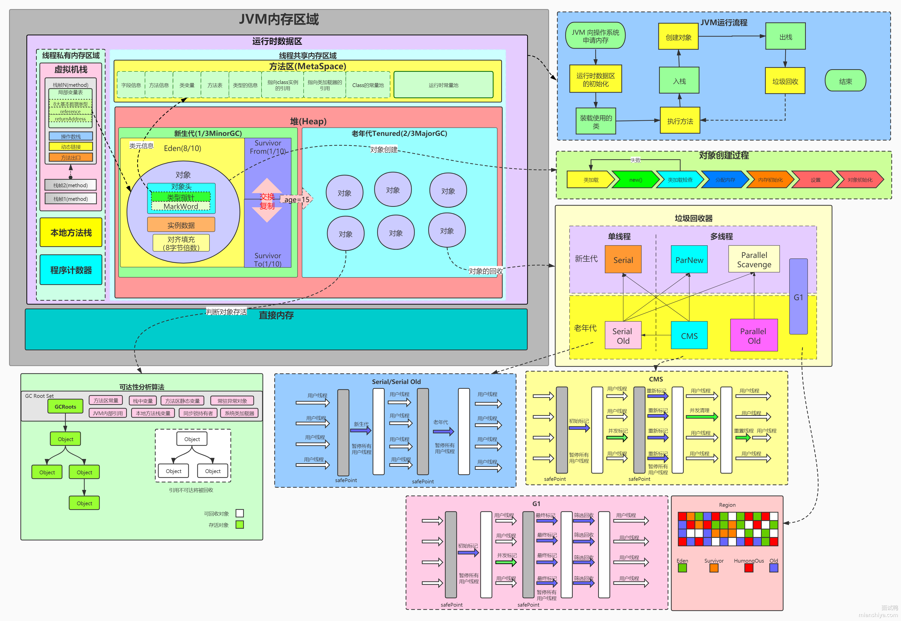
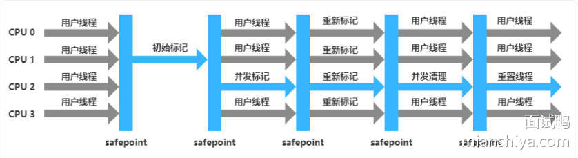
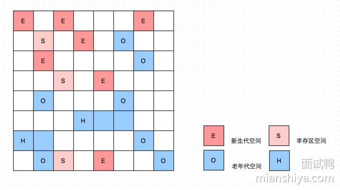

# JVM

## 1. JVM 的组成部分

- 类加载器 ClassLoader
- 运行时数据区 Runtime Data Area
	- 方法区 Method Area，存放类信息、常量、静态变量、即时编译器编译后的代码等数据，在 JDK 8 之后，被元空间替代，使用本地内存
	- 堆 Heap
	- Java 栈 Java Stack，存放局部变量、操作数、动态链接、方法出口信息等
	- 本地方法栈 Native Method Stack
	- 程序计数器 Program Counter Register
- 执行引擎 Execution Engine
	- 解释器 Interpreter
	- 即时编译器 JIT Compiler
	- 垃圾回收器 Garbage Collector
- 本地接口 Native Interface

### 方法区和永久代

在 JDK 8 之前，方法区使用永久代实现，在 JDK 8 之后，永久代被移除，改为元空间实现。永久代的大小固定，元空间使用本地内存，可以动态扩展。

## 2. 编译和解释

在 JVM 中，代码首先会**编译**成为 JVM 指令，然后被**解释**成为机器指令 (跨平台支持)。如果一个代码经常被执行，那么 JVM 会将其**编译**为机器指令，这样可以提高性能，避免频繁解释。

## 3. TLAB 是什么

^TLABLINK

TLAB (Thread Local Allocation Buffer) 是 JVM 在 Eden 区域为每个新启动的线程分配的一小块私有区域。当线程需要创建新对象时，它会首先尝试在这个属于自己的 TLAB 中分配内存。

由于堆结构是线程共享的，所以如果线程要在堆上创建对象，就需要竞争堆的锁，这会导致性能下降。而 TLAB 虽然也是在堆上，但是每个线程都会有一个自己的 TLAB，所以不需要考虑线程安全问题。

TLAB 的工作原理如下：

- 线程会优先在 TLAB 中分配内存。
- 如果 TLAB 满了，线程会向 JVM 请求新的 TLAB。
- 如果分配的对象大于 TLAB 的容量，则直接在 Eden 区域分配，此时需要考虑同步问题。
- 如果 TLAB 申请失败，则直接在 Eden 区域分配，此时需要考虑同步问题。

## 4. 直接内存

Java 中的直接内存指的是由操作系统管理的内存区域，不受 JVM 管理。直接内存可以通过 NIO 包中的 ByteBuffer 来分配。

在进行网络或者文件 IO 操作时，需要调用操作系统的 API，此时通常涉及到用户态到内核态的转换。如果数据在 Java 堆中，那么在进行转换前，通常需要把数据从用户态内存复制到内核态内存中，这样会导致性能下降。而直接内存则是 JVM 可以直接访问，操作系统内核也能直接访问的内存区域，使用直接内存可以避免复制操作，提高性能。

直接内存的缺点是需要手动分配，也需要手动释放内存，否则会导致内存泄露。需要好好管理直接内存的分配与释放。

可以使用 `ByteBuffer.allocateDirect()` 来分配直接内存。

## 5. 常量池

常量由于不变性，所以即使是引用类型，也可以只分配一次内存，然后使得后续的对象引用同一块内存。常量池是为了节省内存而设计的。例如，对于 `String str = "Hello";`，会检查常量池中是否存在 `"Hello"` 对象，如果不存在则创建并返回常量池的对象。而 `String str = new String("Hello");` 这种使用 `new` 关键字创建的方法则和常量没有关系，它是一个对象，会创建在堆中。

### `inter()` 方法

`String` 类的 `intern()` 方法用于将字符串添加到常量池中。如果常量池中已经存在，则返回常量池中的引用。

## 6. 类加载器

类加载器就是 JVM 用来查找和加载 `.class` 文件的工具，并将其转换成 JVM 内部可以使用的 `Class` 对象的组件。

- 类加载器在运行时根据需要动态地加载类，而不是在编译时加载所有的类。
- 类加载器可以隔离不同的类命名空间。

### 启动类加载器

这是 JVM 自身的一部分，它是最顶层的类加载器。它负责加载 Java 的核心类库，这些是最基础、最重要的类，例如 `java.lang.Object` 等。逻辑上，它是所有类加载器的父类。

### 扩展类加载器

扩展类加载器负责加载 Java 的扩展库，这些库通常位于 `$JAVA_HOME/lib/ext` 目录下。它的父类是启动类加载器。

### 应用类加载器

这个类加载器是我们最常打交道的。它负责加载用户自己编写的 Java 类，也就是我们应用程序的类。在没有自定义类加载器的情况下，我们程序中的类默认都是由它加载的。你可以通过 `ClassLoader.getSystemClassLoader()` 获取到它的实例。

### 双亲委派机制

上面的三个类加载器并不是各自独立工作的，它们通过双亲委派机制合作工作，当一个类加载器收到加载某个类的请求时，具体的工作流程如下：

1. 向上委派：它首先不会自己加载，而是会把请求委派给父加载器
2. 递归委派：父加载器收到后，也会先尝试向上委派
3. 顶层尝试加载：启动类加载器收到请求后，首先检查它负责的核心类中是否有请求需要加载的类，如果有则加载，请求结束
4. 向下尝试：父加载器加载失败后，子加载器会尝试自己加载，如果也找不到，则会通知自己的子加载器 (请求者)，如果找到了，则加载成功，请求结束。
5. 加载失败：所有类加载器都找不到这个类，抛出异常 `ClassNotFoundException` 或者 `NoClassDefFoundError`。

#### 为什么是从顶层向下加载

主要是为了安全性，如果一个恶意类和 Java 核心类是同名的，那么从顶向下加载可以保证先加载到核心类，而不会加载到用户自定义的类。这样可以避免一些潜在的安全问题。

## 7. JIT 和 AOT

### 7.1 JIT

JIT (Just In Time) 即时编译器是 JVM 的一部分。它可以把热点代码在**运行时**编译成为机器码，减少频繁解释的开销。同时在编译时还会进行多种优化技术。

JIT 编译的机器码的入口存放在方法区中，而实际的机器码存放在 Code Cache 中，它是一块独立的内存区域 (本地内存)。

### 7.2 AOT

AOT (Ahead Of Time) 是在**程序运行之前**，将 Java 字节码编译成机器码的技术，它可以减少运行时的编译开销，提高启动速度。不过编译出来的机器码就无法跨平台了，并且难以优化。

## 8. 逃逸分析

**逃逸分析是 Java 虚拟机 (JVM) 中一项重要的编译器优化技术**。它的主要任务是分析一个**新创建的对象**的使用范围，判断这个对象是否会“逃逸”出它被创建的方法或者当前的线程。

逃逸的定义有两种：

1. 方法逃逸：一个对象在方法外部被访问，例如作为方法返回值返回了，或者作为方法参数传递到其他方法中。
2. 线程逃逸：一个对象可能被多个线程访问，例如静态变量。

如果经过逃逸分析，发现对象没有逃逸，那么 JIT 可以做一些比较激进的优化，从而提升性能，减少 GC 压力，下面是一些优化的例子：

1. 栈上分配，对于那些不会逃逸的变量，可以直接在线程的栈帧上分配空间，而不是在堆上分配，这样就会自动释放内存，而不会需要 GC
2. 标量替换，并不真正地创建这个对象，而是把这个对象成员变量直接作为局部变量分配在栈上
3. 锁消除，对于那些不会逃逸的变量，所有针对于这个变量的锁都是冗余的，可以直接消除锁，因为它不是线程逃逸，是线程安全的

之前说过，对于热点代码，JIT 会把它编译成为机器码，在这个过程中还会进行优化。逃逸分析就是 JIT 优化中的一个步骤。

## 9. 引用

在 JVM 中主要有 4 种引用类型：

- 强引用：只要对象有一个强引用，那么它就不会被 GC 回收
- 软引用：如果对象只有软引用，那么在内存不足时，它会被 GC 回收 (先进行过一次 GC，然后内存还是不足，这个时候就会回收软引用)
- 弱引用：如果对象只有弱引用，那么在下一次 GC 时，它会被回收
- 虚引用：虚引用无法单独使用，需要在声明时配合引用队列使用，它不会影响到 GC 回收。当对象即将要被 GC 回收时，会被放入引用队列中，这个时候使用者需要从引用队列中取出消息进行处理，否则对象无法被释放

作用强的引用效果覆盖作用效果弱的引用，例如，如果一个对象有软引用和弱引用，那么它的特性就是软引用的特性，只有内存不足的时候才会被 GC 回收。

## 10. 垃圾回收

### 10.1 垃圾回收器种类

#### 新生代

- Serial，单线程垃圾收集器，会触发 STW (Stop The World)，会暂停所有的线程，直到垃圾回收完成
- ParNew，Serial 的多线程版本，通常与 CMS 配合使用，仍然会 STW，只是多线程而已
- Parallel Scavenge，吞吐量优先的垃圾收集器，也是多线程的，它致力于提高吞吐量，它会减少单位时间内的 GC 总时间，但是单次 GC 的时间会相较来说比较长

#### 老年代

- Serial Old，单线程垃圾收集器，使用标记整理算法进行垃圾回收
- Parallel Old，Parallel Scavenge 的老年代版本，吞吐量优先的垃圾收集器，使用标记整理算法进行垃圾回收
- CMS，使用标记清除算法
^CMSLINK

垃圾回收过程分为 4 个步骤：

1. 初始标记，标记 GC Roots 直接关联的对象，耗时短，但是会 STW
2. 并发标记，从 GC Roots 直接关联的对象开始遍历，标记所有可达对象，耗时长，但是不会 STW
3. 重新标记，在步骤 2 的过程中，有可能会有对象被修改，所以需要重新标记，耗时短，但是会 STW
4. 并发清理，清除没有被标记的对象，耗时长，但是不会 STW，这个过程中也会产生垃圾，它们被称为浮动垃圾

CMS 的特点如下：

由于存在浮动垃圾，所以当内存不足时如果才进行 CMS，可能已经来不及了
CMS 可能会产生内存碎片，导致内存不足

- G1，设计用于取代 CMS 的垃圾收集器

### 10.2 判断对象是否是垃圾

- 引用计数
	- 每个对象都有一个引用计数器，当有引用指向它时，计数器加 1，当引用不再指向它时，计数器减 1，当计数器为 0 时，表示这个对象是垃圾
	- 缺点：无法处理循环引用的问题
- 可达性分析
	- 通过一系列的 GC Roots 对象作为起点，遍历所有可达对象，无法到达的对象就是垃圾，它是 Java 中主要使用的算法
	- 缺点：资源和开销比较大

## 11. 永久代和元空间

在 Java 8 之前，JVM 使用永久代来存储一些自己需要的信息：

- 类的元数据，例如类的结构信息 (字段、方法等)
- 字符串常量池
- 静态变量

永久代的缺点：

- 大小固定，容易导致 `OutOfMemoryError: PermGen Space`。如果应用程序加载了大量的类，或者使用大量字符串，永久代就很容易溢出
- 永久代的垃圾回收效率比较低，由于永久代位于堆内存中，所以是会受到 GC 管理的

在 Java 8 之后，永久代被移除，改为使用元空间 (Metaspace)。元空间的特点：

- 元空间使用本地内存，而不是 JVM 堆内存。这说明元空间的大小只受限于系统的可用内存
- 类的元数据保存在元空间中，字符串常量池仍然在堆中

## 12. 三色标记算法

三色标记算法用于在垃圾回收的过程中追踪和标记存活对象，在并发标记和增量标记的场景下非常有用。三色标记算法中将对象从逻辑上标记为三种颜色：

- 白色：表示对象没有被标记过
	- 在初始标记阶段，所有对象都是白色的
	- 在最终阶段，会回收所有白色对象
- 灰色：表示对象被标记过，但是它引用的其他对象还没有处理
- 黑色：表示对象被标记过，并且它引用的其他对象也都被处理过
	- 在最终阶段，所有存活的对象都是黑色的

三色标记算法的流程如下：

1. 初始阶段，所有的对象都是白色的，其中 GC Roots 直接引用的对象是灰色的，将所有灰色对象加入队列
2. 循环处理，从队列中取出一个灰色对象，扫描它的直接引用对象，如果是白色，则将其改为灰色并加入队列，否则跳过
	- 当这个对象的所有直接引用对象都被处理过后，将它改为黑色
3. 当队列为空时，处理完成，回收所有白色的对象

## 14. Young GC、Old GC、Full GC 和 Mixed GC

- Young GC：
	- 发生在新生代，主要回收新生代中的对象
	- 通常使用复制算法，将存活的对象从 Eden 区域复制到 Survivor 区域
	- 触发条件：当 Eden 区域满时，进行 Young GC；当 Eden 和 Survivor 区域都无法放下新创建的对象时，会进行 Young GC
- Old GC：
	- 发生在老年代，主要回收老年代中的对象
	- 通常使用标记清除或标记整理算法
	- 触发条件：当老年代空间不足，或者老年代中的对象数量超过一定阈值时，进行 Old GC
- Full GC：
	- 对整个堆内存进行内存回收，可能还涉及到元空间的回收
	- 触发条件：当老年代空间不足，并且 Old GC 无法回收足够的空间时，进行 Full GC
- Mixed GC：
	- G1 垃圾回收器特有的，会同时回收新生代和**部分**老年代的内存

## 15. PLAB 是什么

与前面的 [TLAB](#^TLABLINK) 非常类似，TLAB 是为了加快新生代内存的分配速度，而 PLAB 则是加快老年代内存的分配速度。在多线程环境下，如果有多个对象需要晋升到老年代，那么老年代就成了共享资源，需要对老年代加锁来保证线程安全，但是这样就会导致性能下降。

PLAB 允许每个垃圾回收线程在老年代中预先分配一小块线程私有的区域。当该线程需要晋升对象时，它会先尝试在 PLAB 中分配内存。如果 PLAB 满了，线程会向 JVM 请求新的 PLAB。这样就可以避免对老年代的锁竞争，提高性能。

## 16. 是什么 Concurrent Mode Failure

Concurrent Mode Failure 是 [CMS](#^CMSLINK) 垃圾回收器会遇到的一种失败现象。在 CMS 执行垃圾回收时，如果老年代空间不足以容纳新晋升的对象，会导致垃圾回收被迫转为 Full GC。

由于 CMS 垃圾回收是并发进行的，所以，如果在进行 CMS 的过程中如果没有及时清理出足够多的空间来满足新对象的分配，就会出现 Concurrent Mode Failure。

一旦出现了 Concurrent Mode Failure，JVM 就会进行 Full GC，此时会暂停所有的线程，直到 Full GC 完成。这会导致应用程序的响应时间变长，甚至可能导致应用程序崩溃。

## 17. 新生代回收如何避免全堆扫描

JVM 的垃圾标识算法用的是可达性分析，它会从 GC Roots 开始遍历所有可达对象，无法到达的对象就是垃圾。在新生代垃圾回收中也会使用可达性分析。但是 GC Roots 的范围是整个堆，也就是不管进行的是新生代回收还是老年代回收，都需要扫描整个堆，这样无疑会导致性能下降。

为了在新生代回收中避免全堆扫描，JVM 会使用卡表 + 写屏障的方式来进行优化。

### 17.1 卡表

老年代内存区域被划分为一个个的卡片 (Card)，每个卡片的大小固定，同时 JVM 维护一个卡表 (Cards Table) 用于记录每个卡片的状态。`CardTable[i]` 表示第 i 个卡片对应的老年代对象引用了新生代的对象。

在进行可达性分析时，JVM 只需要扫描新生代的对象引用的卡片即可，而不需要扫描整个老年代。这样就可以避免全堆扫描，提高性能。

### 17.2 写屏障

卡表的修改由写屏障来保证。当程序执行引用字段赋值操作时 `object.field = reference` 时，JVM 会检查 object 是否是老年代对象、reference 是否是新生代对象。如果是，则会将 object 所在的卡片标记为 dirty，这样就可以保证卡表的状态是最新的。
