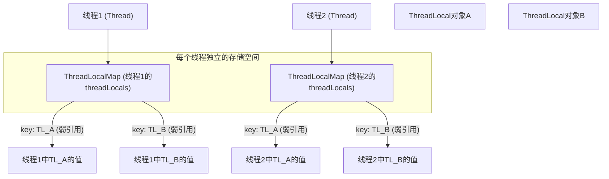

# Java 并发

## 1. 线程同步

线程同步是指在多线程环境下，防止多个线程在操作同一个共享资源时，共享资源出现的数据不一致问题。

- synchronized 关键字

它是 Java 提供的关键字，用于给一个方法或者一段代码加锁。同时它可以配合 `wait()、notify()、notifyAll()` 方法实现条件等待。下面给出一个生产者-消费者模型：

```java
public class ProducerConsumerExample {
    // 共享的缓冲区
    private final Queue<Integer> buffer = new LinkedList<>();
    // 缓冲区最大容量
    private final int CAPACITY = 5;
    // 用于同步的锁对象
    private final Object lock = new Object();
    // 生产者线程
    class Producer extends Thread {
        @Override
        public void run() {
            for (int i = 0; i < 10; i++) {
                synchronized (lock) { // 获取锁
                    // 如果缓冲区满了，生产者等待
                    while (buffer.size() == CAPACITY) {
                        try {
                            lock.wait(); // 释放锁并等待
                        } catch (InterruptedException e) {
                            e.printStackTrace();
                        }
                    }
                    // 缓冲区未满，生产数据并添加到缓冲区
                    buffer.add(i);
                    // 通知消费者可以消费了
                    lock.notify(); // 唤醒一个等待的消费者线程
                } // 释放锁
            }
        }
    }
    // 消费者线程
    class Consumer extends Thread {
        @Override
        public void run() {
            for (int i = 0; i < 10; i++) {
                synchronized (lock) { // 获取锁
                    // 如果缓冲区空了，消费者等待
                    while (buffer.isEmpty()) {
                        try {
                            lock.wait(); // 释放锁并等待
                        } catch (InterruptedException e) {
                            e.printStackTrace();
                        }
                    }
                    // 缓冲区不空，消费数据
                    int data = buffer.remove();
                    // 通知生产者可以生产了
                    lock.notify(); // 唤醒一个等待的生产者线程
                } // 释放锁
            }
        }
    }
}

```

- ReentrantLock

它是 JUC 提供的可重入锁，比 synchronized 更加灵活，具体的不在此处介绍。

## 2. 线程安全

Java 常用的线程安全措施：

1. 同步锁：synchronized 关键字、ReentrantLock
2. 原子操作：AtomicInteger、AtomicReference 等
3. 线程安全的容器：ConcurrentHashMap、CopyOnWriteArrayList 等
4. 局部变量：线程内部的局部变量是线程安全的
5. ThreadLocal：线程本地资源，与局部变量类似

## 3. 协程

- 线程是 CPU 调度的基本单位，它是一个操作系统层面的东西，但是线程在进行切换的时候，需要进行上下文切换、恢复现场、用户态内核态切换等操作，开销不小
- 协程是一个编程语言层面的东西，协程在进行切换的时候，不会进行用户态内核态的切换，开销比线程要小

Java 中有类似的协程的实现，具体的不展开介绍。

> 多线程、协程和异步：
> 1. 多线程是操作系统层面的，协程是编程语言层面的
> 2. 异步是一种概念，它表示非阻塞的执行方式，例如当 CPU 遇见 IO 操作时，它可以选择不等待，转而去执行其他操作，等这个 IO 操作执行结束后再回来处理结果
> 3. 多线程、协程、单线程 + 回调函数的模型都是异步的实现方式

## 4. 线程生命周期

- 新建状态：对象创建，但是还没有调用 start() 方法
- 就绪状态：调用了 start() 方法，等待 CPU 时间片
- 执行状态：正在执行
- 阻塞状态：等待锁
- 等待状态：调用了 wait() 方法，等待其他线程的通知
- 等待时间：调用了 wait(time) 方法
- 终止状态：执行结束

## 5. 线程通信

1. 共享变量
2. 同步机制
	- synnchronized 关键字
	- ReentrantLock
	- BlockingQueue
		- 若队列为空，当线程想要取东西时会被阻塞，当队列不为空时会被自动唤醒
		- 若队列满了，当线程想要放东西时会被阻塞，当队列不满时会被自动唤醒
	- CountDownLatch
		- 一个线程可以利用 CountDownLatch 等待多个工作线程执行完成
		- 在事先设定好 CountDownLatch 的初始值，在每个工作线程完成后使它的值减一
		- 当值为 0 时，等待的线程会被唤醒
		- 和信号量很像，但是语义更加清晰
	- CyclicBarrier
		- 适用于需要将一个大任务分解成多个子任务，并且这些子任务需要分阶段并行执行的场景。在每个阶段的末尾，所有子任务都需要等待其他子任务完成当前阶段，然后才能一起进入下一个阶段。
	- Volatile
		- 确保变量的可见性，防止指令重排
	- Semaphore

## 6. 多线程的创建方式

1. 继承 Thread 类 (不推荐，因为 Java 不允许多继承)
2. 实现 Runnable 接口 (推荐，没有返回值)
3. 实现 Callable 接口 (有返回值，需要配合 FutureTask\<RetType\> 使用)
4. 线程池 ExecutorService (推荐)
5. CompletableFuture (推荐，与线程池类似)

## 7. 线程池原理

线程池相关概念：

1. 核心线程数：根据 CPU 核心数计算出的线程池中线程数量的**最合适**的值
2. 最大线程数：线程池中可存放的最大线程数量 (大于核心线程数，核心线程数表示最合适的值，当任务比较多时，线程数会超过核心线程数)
3. 空闲线程存活时间：当线程池中的线程数超过核心线程数时，空闲线程存活的时间
4. 工作队列：存放任务的队列
5. 拒绝策略：当线程池中的线程数达到最大线程数，并且工作队列已满时，对新来的任务采取什么样的策略

线程池工作流程：

1. 线程池刚创建时，不会创建线程，当有任务提交时，线程池才会创建线程执行
2. 如果线程的数量没有达到核心线程数，则对每一个新来的任务 (没有空闲线程)，都会创建一个新的线程来执行，并且不会主动销毁空闲线程
3. 如果线程的数量已经达到核心线程数，则会将任务放入工作队列中 (没有空闲线程)
4. 如果工作队列已满，线程的数量达到核心线程数，那么将创建新的线程来执行**新来的任务** (插队)
	1. 如果在步骤 4 中新创建的线程空闲下来了，如果它空闲时间达到了设置的值，则会销毁该线程
5. 如果工作队列已满，线程的数量达到最大线程数，那么对于新来的任务将会采取预先设置好的拒绝策略

```java
ExecuteService threadPool = new ThreadPoolExecutor(<int 核心线程数>, <int 最大线程数>, <long 空闲时间>, <TimeUnit 空闲时间单位>, 
												   <BlockingQueue<Runnable> 工作队列 (初始化时需指定大小)>,
												   <ThreadFactory 线程工厂 (用于指定如何创建线程，线程的名称)>,
												   <RejectExecutionHandler 拒绝策略>);
```

通常不推荐使用 `Executors.newFixedThreadPool()` 这类的方法来创建线程，因为它使用的工作队列类型是 `LinkedBlockingQueue`，这是一种无界队列 (队列大小可达 $2^{31} - 1$)，在任务量重的情况下，会对性能造成严重影响。

### 7.1 如何合理设置线程池的核心线程数

- CPU 密集型任务: $核心线程数 = CPU \ 核心数 + 1$
- I/O 密集型任务: $核心线程数 = CPU \ 核心数 \times 2$

### 7.2 拒绝策略

- AbortPolicy (默认)，直接抛出异常
- CallerRunsPolicy，由调用者线程执行
- DiscardOldestPolicy，丢弃最早的任务
- DiscardPolicy，丢弃当前任务，即不进行任何操作

### 7.3 JUC 中常见的线程池实现 (不推荐使用)

- FixedThreadPool，最普通的线程池，并且线程数量固定
- CachedThreadPool，线程数量没有上限，空闲线程会在 60s 后被回收
- SingleThreadPool，只有单个线程的线程池
- ScheduledThreadPool，以固定周期执行任务的线程池
- WorkStealingPool，每个线程都有一个工作队列，如果自己的工作队列为空，则可以从其他的线程队列中获取任务

### 7.4 如何在线程池运行时修改线程池的核心线程数

可以通过 ThreadPoolExecutor 的 setCorePoolSize() 方法来修改核心线程数。修改核心线程数时，不会对当前正在运行的线程造成影响。只是在新的任务到来时，会造成影响。

### 7.5 shutdown 和 shutdownNow 方法

`shutdown()` 和 `shutdownNow()` 方法都可以用来关闭线程池，不过 `shutdown()` 会等待线程池中所有的任务执行完成之后再关闭，而 `shutdownNow()` 则是强制关闭线程池，它会尽力终止正在执行的任务，但是并不能保证所有的任务能立刻终止。

shutdown 会使得线程池进入 SHUTDOWN 状态，而 shutdownNow 会使得线程池进入 STOP 状态。

### 7.6 线程池的状态

- RUNNING 状态：线程池可以接收新的任务
- SHUTDOWN 状态：线程池不再接受新的任务，但是会继续执行已经提交的任务
- STOP 状态：线程池不再接受新的任务，并且会尝试中断正在执行的任务
- TERMINATED 状态：所有任务执行完成并且线程池关闭

### 7.7 任务出现异常时，如何知道是哪个线程

主要有三种常用的方法：

1. 自定义线程的 `ThreadFactory`，同时为每个线程设置一个异常处理器 `UncaughtExceptionHandler`，来记录异常的线程信息。

```java
public class CustomThreadFactory implements ThreadFactory {
    @Override
    public Thread newThread(Runnable r) {
        Thread thread = new Thread(r);
        thread.setUncaughtExceptionHandler((t, e) -> {
            System.out.println("面试鸭Thread " + t.getName() + " threw exception: " + e);
        });
        return thread;
    }
}
```

2. 使用 `Future` + `submit()` 方法来提交任务，`Future` 的 `get()` 方法会抛出异常，可以通过 `get()` 方法来获取异常信息。因为 `Future` 和任务是一一对应的，所以可以通过 `Future` 来获取异常信息。

```java
public class ThreadPoolWithFuture {
    public static void main(String[] args) {
        ExecutorService executor = Executors.newFixedThreadPool(5);

        Future<?> future = executor.submit(() -> {
            throw new RuntimeException("Exception in thread");
        });

        try {
            future.get(); // 可以获取报错
        } catch (InterruptedException | ExecutionException e) {
            System.out.println("Task threw exception: " + e.getCause());
        }

        executor.shutdown();
    }
}
```

3. 在任务的 `run()` 方法中，手动捕获异常

```java
public class TaskWithExceptionHandling implements Runnable {
    @Override
    public void run() {
        try {
             // do sth
            throw new RuntimeException("Exception in task");
        } catch (Exception e) {
            System.out.println("手动打印：Exception caught in thread " + Thread.currentThread().getName() + ": " + e);
        }
    }
}
```

- 如果使用 `execute()` 执行任务，任务抛出的异常可以在堆栈的打印中看到，同时线程池会把执行任务的线程销毁，并创建一个新的线程
- 如果使用 `submit()` 执行任务，任务抛出的异常不会在堆栈的打印中看到，线程池也不会销毁执行任务的线程，在调用 `Future.get()` 时可以捕获到抛出的异常

## 8. Timer

`Timer` 是一个用于在未来某个时刻或者周期性执行任务的工具类。它通常与 `TimerTask` 配合使用，`TimerTask` 是一个抽象类，用于定义需要执行的任务。下面是一个简单的例子：

```java
Timer timer = new Timer();
TimerTask task = new TimerTask() {
   @Override
   public void run() {
       System.out.println("Task executed!");
   }
};
timer.schedule(task, 2000);  // 2 秒后执行任务
```

`Timer` 原理：

`Timer` 内部维护一个**小根堆**结构，剩余时间最短的任务 (即最早到期的任务) 会被放在堆顶。每次执行任务时，都会从堆中取出堆顶的任务来执行。`Timer` 会启动一个 `TimerThread` 线程不断检查顶部的任务时间是否到期，如果到期则执行，否则 `wait()`。

`Timer` 的内部其实还是单线程执行的，所以如果任务量比较多的话 (TimerTask 都是同步的)，还是会出现阻塞的情况。除此之外，如果其中一个任务出现异常，那么剩下的任务也都无法执行。

建议使用更加强大的 `ScheduledExecutorService` 来代替 `Timer`。

```java
class Solution {  
    public static void main(String[] args) {  
        ScheduledExecutorService scheduledExecutorService = new ScheduledThreadPoolExecutor(3);  
        FutureTask<Void> task = new FutureTask<>(() -> {  
            System.out.println("Task is running");  
        }, null);  
        scheduledExecutorService.schedule(task, 3, TimeUnit.SECONDS);  
        scheduledExecutorService.shutdown();  
    }  
}
```

## 9. 时间轮

[时间轮](../../全局静态资源/Excalidraw/TimeWheel.md)是一种数据结构，用于管理和调度大量的定时任务。它是一个环形数据结构，将时间划分为若干个时间片段分布在环上，每个时间片段管理对应的定时任务。


例如，对于一个延迟 5s 的任务，它可能就会放在时间轮上下标为 5 的位置上，表示这个任务将在 5s 后执行。时间轮的每个时间片段都可以存放多个定时任务，这些任务会在对应的时间片段到达时被执行。

但是如果现在有一个延迟 500s 的任务，它应该会放在时间轮上下标为 500 的位置上，但是时间轮的大小是有限的，此时有两种解决方法：

1. 记录轮转的圈数，轮转一圈是 8s，那么 500s 就是 62 圈 + 4s，所以应该在轮转 62 圈后去下标为 4 的位置执行任务
2. 多层时间轮，就像时钟一样，内层的时间轮每秒钟走一次，内层的走一圈，外层的走一次。这样可以支持的延迟时间就会大大增加了。对于一个三层的 8s 时间轮，可以支持 8 * 8 * 8 = 512s 的延迟时间。


多层时间轮还可以进行降级优化，越是靠外层的时间片，精度就越低，所以对于一个 500s 的任务，它原本是在第三层，在过了 436s 后，它可以降级到第二层了。

## 10. Semaphore

信号量通常用于**限制同时访问特定资源的线程数量**。相关概念如下：

- 许可数目：信号量内部维护一个计数器，表示可以资源的线程数量，线程在访问资源时需要获取许可，访问完成后归还许可，若许可不足，则阻塞线程
- 获取许可：`acquire()` 线程在访问资源前需要获取许可，若许可不足，则线程会被阻塞
- 释放许可：`release()` 线程在完成资源访问后需要释放许可
- 公平/非公平策略：
	- 公平策略：线程按照请求许可的顺序获取许可，防止出现饥饿现象，但是会导致性能下降
	- 非公平策略：不保证顺序，性能提升，但是可能出现饥饿现象

```java
class Solution {  
    public static void main(String[] args) throws InterruptedException {  
	    // 初始许可数量为 10，表示最多允许 10 个线程同时访问资源
        Semaphore semaphore = new Semaphore(10);  
        semaphore.acquire();  
        try {  
            // Perform some work  
        }  
        finally {  
            semaphore.release();  
        }  
    }  
}
```

## 11. CyclicBarrier

`CyclicBarrier` 是一个同步辅助类，允许一组线程在执行某个任务时相互等待，直到所有的线程都达到「屏障」之后，才会继续执行。


`CyclicBarrier` 是基于 `ReentrantLock` 和 `Condition` 实现的。它会维护一个计数器，在每个线程到达屏障时，计数器减一，如果计数器不为 0，则线程调用 Condition.await() 方法阻塞；如果计数器等于 0，则使用 Condition.signalAll() 方法唤醒所有线程。

```java
class Solution {  
    public static void main(String[] args) throws InterruptedException {  
        // 创建 CyclicBarrier        
        CyclicBarrier barrier = new CyclicBarrier(3, () -> System.out.println("All parties have arrived at the barrier. Proceeding..."));  
        // 分配任务  
        for (int i = 0; i < 3; ++i) {  
            new Thread(() -> {  
                try {  
                    Thread.sleep((long) (Math.random() * 3000L));  
                    System.out.println(Thread.currentThread().getName() + " arrived at the barrier.");  
                    barrier.await();  
                } catch (InterruptedException | BrokenBarrierException e) {  
                    throw new RuntimeException(e);  
                }  
            }).start();  
        }  
    }  
}
```

## 12. CountDownLatch

`CountDownLatch` 允许一个或者多个线程等待其他线程的一组操作完成。它维护一个计数器，每当一个线程完成工作，会使得计数器减少，当计数器减少到 0，所有等待在 `CountDownLatch` 上的线程会被唤醒。

```java
class Solution {  
    public static void main(String[] args) throws InterruptedException {  
        // 创建 CountDownLatch        
        CountDownLatch latch = new CountDownLatch(3);  
        // 创建 3 个线程执行  
        for (int i = 0; i < 3; ++i) {  
            new Thread(() -> {  
                System.out.println("Thread " + Thread.currentThread().getName() + " is doing some work...");  
                latch.countDown();  
            }).start();  
        }  
        System.out.println("Main thread is waiting for other threads to finish...");  
        latch.await();  
        System.out.println("All threads have finished their work.");  
    }  
}
```

可以看到 `CountDownLatch` 与 `CyclicBarrier` 非常相似，但是 `CountDownLatch` 只能使用一次，而 `CyclicBarrier` 可以重复使用。`CountDownLatch` 适合用于等待多个线程完成，而 `CyclicBarrier` 适合用于多个线程之间的相互等待。

## 13. StampedLock

`StampedLock` 是 Java 8 引入的一种锁的实现，与 `ReentrantLock` 和 `ReadWriteLock` 相比，`StampedLock` 引入了乐观读锁，在**读多写少**的环境下，性能更高。`StampedLock` 的特性如下：

- 写锁：写锁与 `ReadWriteLock` 类似，仍然是独占锁。
- 悲观读锁：允许多个线程同时获取读锁，但是会阻塞写锁。
- 乐观读锁：无需阻塞等待写锁，当检测到写操作发生时，会退回到悲观读锁或者重试。
- 时间戳：`StampedLock` 内部维护一个时间戳，用于标识锁的状态。

缺点：

- 不可重入：一个线程在持有锁的情况下不可以再次获取该锁，否则会造成死锁
- 读锁饥饿：在写入操作频繁的情况下，读锁可能会一直被阻塞
- CPU 开销大：StampedLock 为了追求高性能，在内部使用了自旋锁，即当获取锁失败时，会先轮询一段时间，如果还是没有获得锁才会阻塞释放 CPU 资源
	- 如果 StampedLock 阻塞在了读锁或者写锁 (readLock() 或者 writeLock()) 上，然后被 interrupt() 了，那么它可能会一直自旋，导致 CPU 占用 100%
	- 可以使用 readLockInterruptibly() 或者 writeLockInterruptibly() 方法来解决这个问题

## 14. 原子类

原子类是 Java 提供的一种线程安全的变量类型，它们使用了底层的 CAS (Compare And Swap) 操作来实现原子性操作。常用的原子类有：

- AtomicInteger：提供原子性的自增、自检、加法操作
- AtomicLong
- AtomicBoolean
- AtomicReference：提供原子性的对象引用操作，原子性体现在引用本身，而不是引用指向的对象
- AtomicStampedReference：避免 ABA 问题
- AtomicIntegerArray 和 AtomicLongArray
- Adder 系列，例如 LongAdder
	- 传统的 `AtomicLong` 使用单一的原子变量来进行累加操作，但是在高并发场景下，会导致大量的 CAS 操作失败，从而开始自旋，而 Adder 的原理如下：
		- 有多个 `Cell` 用来统计累加操作，每个 `Cell` 都可以接待一个线程，这样就分散了压力。当需要读取值时，会统计所有的 `Cell` 中的累加值并返回，在高并发场景下虽然无法保证绝对准确，但是在近似准确的场景下性能会更高

## 15. CAS

CAS 是一种硬件层面的原子操作，它通常需要三个参数：内存位置，预期值和新值。CAS 操作会检查内存位置的值是否等于预期值，如果相等，则将内存位置的值更新为新值，否则不进行任何操作。

优点：

- 无锁：CAS 操作不需要加锁，因此不会导致阻塞，提高系统的并发性能
- 原子性：CAS 操作是线程安全的

缺点：

- ABA 问题：如果线程 A 此时读取到了共享变量的值为 a，它想通过 CAS 操作把它改为 b，但是在它执行 CAS 操作之前，如果其他线程 B 先把 a 修改为了 b，然后线程 C 又把 b 改回了 a。此时线程 A 进行 CAS 操作时，是无法知道共享变量的值曾经变成 b 过的。
	- 可以通过 `AtomicStampedReference` 来解决这个问题，它在 CAS 操作时会附带一个版本号，只有当版本号一致时才会进行更新
- 自旋：CAS 如果操作失败会返回 false，这个时候一般会进行自旋，然后多次尝试，这会导致 CPU 资源浪费。
- 单变量限制：CAS 操作只能对单个变量进行操作，无法对多个变量进行原子操作，因此在一些复杂的场景下，可能需要使用锁来保证线程安全。
- 总线风暴：几乎所有涉及到原子写操作的硬件指令都会存在这个问题，主要原因在于在进行完写操作之后，需要通知其他 CPU 核心更新自己的缓存（根据缓存一致性协议），此时就会产生很大的总线流量导致总线风暴。

## 16. AQS

`AQS` 起到一个抽象、封装的作用，提供一些基础的排队、入队、加锁等方法，便于其他 JUC 组件的实现。

`AQS` 主要维护一个 `state` 状态变量 (表示当前锁的状态, volatile 修饰)，以及一个队列数据结构 (表示等待获取锁的线程)。

当线程尝试获取资源时，首先会通过 CAS 操作尝试将 `state` 改为上锁状态 (预期值是 `state` 没有上锁)。如果操作成功，则表示获取锁成功；如果操作失败，则会将当前线程加入等待队列中，并阻塞自己等待唤醒。

上面说到是 AQS 的基本流程，事实上根据不同类的锁，具体实现也是不同的。`AQS` 常见的实现类有 `ReentrantLock、CountDownLatch、Semaphore` 等。


## 17. ReentrantLock

`ReentrantLock` 是 `AQS` 的一个实现类，它是一个可重入的锁，支持非公平 (默认方式) 和公平两种方式。其内部维护两个队列：同步队列 (双向链表) 和等待队列 (单向链表)。通过 CAS 修改 state 来争夺锁资源，除此之外，还需要维护一个变量来表示当前锁的持有者 (为了支持可重入)。

`ReentrantLock` 内部维护的几个重要的变量：

- `state`：表示锁的状态，0 表示空闲，1 表示占用
- `exclusiveOwnerThread`：表示当前锁的持有者
- 等待队列 (单向链表)
- 同步队列 (双向链表)
- `waitStatuss`：表示当前节点 (线程放到队列中会被封装成一个节点) 的状态：
	- 0 (Initial)：表示初始状态
	- -1 (SIGINAL)：表示当前节点在释放锁或者被取消时，需要唤醒队列中的下一个节点 (也就是后继节点)
	- 1 (CANCELLED)：表示当前节点因为**超时**或者**中断**而放弃了获取锁的尝试，处于 `CANCELLED` 的节点会被移除同步队列
	- -2 (CONDITION)：只会在等待队列中使用，表示调用了 `Condition` 对象的 `await()` 方法，当前节点处于等待状态
	- -3 (PROPAGATE)：用于共享模式，表示当前的释放操作需要向后传播，由于 `ReentrantLock` 是一个独占锁，所以不会使用这个状态

下面介绍一下 `ReentrantLock` 的工作流程 (此处不涉及 `Condition` 操作)：

1. 通过 CAS 操作 `state` 变量，尝试获取锁
	1. 如果获取锁成功，则 `state` 置为 1，`exclusiveOwnerThread` 置为当前线程
	2. 如果获取锁失败，则检查 `exclusiveOwnerThread` 的值是否为当前线程，这是为了支持可重入特性
		1. 如果是，则正常进行后续流程
		2. 如果不是，则将当前线程加入到**同步队列**中，并调用 `LockSupport.park()` 方法阻塞自己 (阻塞前还会再次检查一次锁的情况)
2. 加入同步队列时，需要被打包为一个称为节点 (Node) 的数据结构，并设置当前的 `waitStatus` 为 0
3. 在调用 `LockSupport.park()` 阻塞前，会将前驱节点的 `waitStatus` 修改为 `SIGNAL`
4. 工作线程释放锁时，会唤醒同步队列的队头节点
	1. 如果是公平模式，队头节点获取锁，然后开始工作，新的线程会直接加入同步队列队尾
	2. 如果是非公平模式，队头节点需要和新的线程争夺锁

通过 `ReentrantLock` 可以获取到 `Condition` 对象，线程可以阻塞在 `Condition` 对象的 `await()` 方法上。每个 `Condition` 对象都维护着一个**等待队列**，当一个线程调用 `notify()` 时，会从等待队列队头取出一个节点，放到**同步队列**的队尾。


---

## Ex 1. 线程池怎么保证核心线程一直存活

一般情况下，线程在执行完成之后，就退出了，而线程池在默认的配置下，不会销毁空闲的核心线程，所以线程池是如何保证核心线程一直存活的呢？

线程池一定是用某种办法阻塞了空闲的核心线程，防止它们退出。

事实上，在创建线程池时需要指定它的工作队列，而这些工作队列都需要实现 `BlockingQueue` 接口。所以当队列中没有任务时，核心线程调用队列的 `take()` 方法就会被阻塞住；而非核心线程则会在阻塞一定的时间后退出。

## Ex 2. ThreadLocal 的原理

`ThreadLocal` 提供了一种线程局部变量机制。通过 `ThreadLocal` 创建的变量，每个线程都会有一个独立的副本。一个线程无法干扰其他线程的变量值。

`ThreadLocal` 的内部结构如下：



每个 Thread 对象内部有一个名为 `ThreadLocalMap` 的对象。它是每个线程独有的一个 Map 对象。这个 `ThreadLocalMap` 的 `Key` 是 `ThreadLocal` 对象，`Value` 则是线程中需要存储的值。

当一个线程使用 `ThreadLocal` 去存储值的时候，首先会获取到当前 `Thread` 的 `ThreadLocalMap` 对象，然后以 `ThreadLocal` 为 `Key`，存储对应的值。

需要注意的是，`ThreadLocalMap` 中的 `Key` 是指向 `ThreadLocal` 的弱引用。这意味着，如果 `ThreadLocal` 没有其他强引用时，它会被垃圾回收器回收，然后 `Key` 自然也会被回收，但是此时 `Value` 并不会被回收掉，依然会存在于 `ThreadLocalMap` 中。这样就会造成内存泄漏的问题。

在一般情况下，如果线程执行完成，`Thread` 被回收时，`Value` 也会被回收。但是在线程池中 `Thread` 对象不会被回收，此时 `Value` 就会一直存在于 `ThreadLocalMap` 中，造成内存泄漏。

所以在使用 `ThreadLocal` 时，应该在不需要使用的时候，调用 `remove()` 方法来删除对应的 `Key` 和 `Value`。这样可以避免内存泄漏的问题。

### ThreadLocal 的缺点

ThreadLocal 主要存在 3 个问题：

1. 内存泄漏，由于 ThreadLocalMap 中的 Key 是弱引用，在线程池环境中，如果忘记调用 Remove() 方法清除 Value，就会造成内存泄漏。
2. 效率较低，在 ThreadLocalMap 中如果发生了 Hash 冲突，解决冲突的方法并不是拉链法，而是线性探测法，这会导致性能下降。
3. 由于 ThreadLocalMap 中的 Key 是弱引用，为了减少内存泄露的情况，ThreadLocal 在调用 get 或者 set 方法时，会主动清理 ThreadLocalMap 中的过期 Key，这会导致 get 和 set 方法的性能下降。

## Ex 3. Synchronized 原理

synchronized 关键字的同步机制是由监视器 (Monitor) 实现的，它的锁升级机制是由对象头中的 Mark Word 实现的。

### 监视器 Monitor

每个 Java 对象都关联一个监视器 Monitor。当一个线程试图进入一个 `synchronized` 修饰的代码块或者方法时，它必须获取该代码块或方法所对应的对象的监视器的锁。

当线程遇到 `synchronized` 关键字时，会尝试获取目标对象的监视器的所有权 (锁)。如果监视器的锁没有被其他线程持有，则获取成功，线程可以进入同步代码块或方法。

如果监视器的锁已经被其他线程所获取，那么线程就会进入阻塞状态。它会被放入一个与该监视器关联的等待队列中，直到监视器的锁被释放。

当持有锁的线程执行完成了同步代码块中的内容后，就会将锁释放，然后 JVM 会从等待队列中选择一个或者全部唤醒。

### 对象头与锁升级

通过 Monitor，synchronized 可以做到线程同步，但是这个阻塞是一个重量级锁，在阻塞时涉及到线程切换和上下文切换，开销较大；为了减小开销，JVM 引入了锁升级机制。

锁升级的核心思想是：尽可能避免使用重量级锁 (依赖操作系统互斥量)，因为它们开销很大。优先使用开销小的锁机制，例如乐观锁等。

锁升级的顺序为：无锁 -> 偏向锁 -> 轻量级锁 -> 重量级锁。

#### 无锁

无锁是对象的初始状态，此时对象头中的 Mark Word 不存储锁的信息。

#### 偏向锁

偏向锁针对的场景是：一个对象的大部分方法只会被同一个线程调用。

当一个对象第一次被线程获取锁时，它会变成偏向锁。

- 线程 A 第一次访问同步块并获取锁，JVM 会检查对象头 Mark Word 中的偏向标记位是否为 0
- 如果是，使用 CAS 操作将当前线程 ID 写入 Mark Word，并把偏向标记位设置为 1
- 如果 CAS 操作执行成功，那么线程 A 就成功获取了偏向锁；线程 A 进行后续访问时，只需检查 Mark Word 中的线程 ID 是否与当前线程 ID 相同即可；如果相同，则无需进行同步操作，直接进入同步代码块

偏向锁不会主动释放，如果有另一个线程 B 尝试获取一个偏向于 A 的锁：

- 检查线程 A 是否还存活，并且在同步代码块中
	- 如果线程 A 不在同步代码块中，则偏向锁会偏向线程 B
	- 否则会暂停所有线程，然后将偏向锁升级为轻量级锁

#### 轻量级锁

轻量级锁针对的场景是：线程交替执行同步块，但是竞争不激烈 (即同一时间只有一个线程访问同步块)。

线程在进入同步代码块时，如果发现对象没有被锁定，则会在当前线程的栈帧中创建一个 `Lock Record` 区域，用于存储对象 Mark Word 的拷贝。

然后 JVM 会使用 CAS 操作将对象的 Mark Word 更新为指向这个 `Lock Record` 的指针。如果 CAS 操作成功，则成功获取了轻量级锁。

如果 CAS 操作失败，则会进行自旋，执行若干次自旋之后，如果仍然无法获取锁，则会将轻量级锁升级为重量级锁。

线程退出同步代码块时，会根据 `Lock Record` 的内容，将 Mark Word 的内容复原。

#### 重量级锁

重量级锁就是根据 Monitor 实现的锁，对象的 Mark Word 会被更新为指向 Monitor 的指针。

### Synchronized 与 ReentrantLock

`synchronized` 和 `ReentrantLock` 都是 Java 中的同步机制，但是它们有一些区别：

| 特性   | synchronized                | ReentrantLock                 |
| ---- | --------------------------- | ----------------------------- |
| 本质   | Java 关键字，JVM 层面实现           | Java 类                        |
| 资源管理 | 隐式获取和释放，代码更简洁               | 需要手动管理                        |
| 公平性  | 非公平锁                        | 默认为非公平锁，支持公平锁                 |
| 中断   | 等待锁时不会响应中断，容易死锁             | lockInterruptibly() 实现可中断的锁等待 |
| 条件变量 | wait()、notify()、notifyAll() | Condition 对象，更加灵活             |

ReentrantLock 通过 CAS 来控制 state 的状态来实现锁的获取和释放，通过 AQS 实现等待。而 AQS 的 LockSupport.park() 与 synchronized 的重量级锁哪个性能更高则是不好说的，因为它们的实现机制不同。

## Ex 4. JMM

在现代计算机体系架构中，为了弥补 CPU 和主存之间的速度差距，引入了多级缓存的概念。其中可能一级缓存、二级缓存是每个 CPU 核心独有的，三级缓存是多个 CPU 核心共享的。

这样就带来了两个问题：

- 缓存不一致 (可见性)：多个线程在不同的 CPU 核心上运行，它们将共享变量从共享缓存中加载到 CPU 核心缓存中。如果一个线程在 CPU 核心缓存中修改了变量，那么其他线程是无法看到的
- 指令重排序 (有序性)：为了提高性能，编译器和处理器可能会对指令进行重排序，这可能导致程序的执行顺序与代码的书写顺序不一致，从而引发线程安全问题。因为指令重排序只保证串行时排序前后含义不变，不保证并行时的不变性

JMM 的目的是为了屏蔽掉各种硬件和操作系统的内存访问差异，提供一个统一的、跨平台的内存访问规范，让 Java 程序员能够在各种平台下，通过遵循 JMM 的规则来开发可预测的并发程序。

首先，JMM 定义了内存的两种形式：

- 主内存：所有线程共享
- 工作内存/本地内存：线程独有

> 注意：上面的主内存和工作内存是抽象的概念，程序员只需要跟这两个内存打交道就行了，具体的哪部分缓存属于主内存，哪部分寄存器属于工作内存不需要关心，这些部分属于实现细节。后面的 JMM 相关概念也都是抽象的。

为了满足并发的三个特性，JMM 定义了几个重要的过程：

### 可见性

当一个线程修改了共享变量的值时，其他线程需要能够立刻看到。

在声明变量的时候，使用 `volatile` 关键字；之后在线程对该变量进行更新操作之后，它会被强制写入主内存中；在线程读取该变量时，它会强制从主内存中读取最新的值。

### 原子性

一个或者多个操作，要么全部执行，要么全部不执行。

- 基本数据的读取和赋值都是原子的
- 多个操作使用 `synchronized` 关键字或者 `ReentrantLock` 来保证原子性
- 使用原子类 (如 `AtomicInteger`) 来保证原子性

### 有序性

程序执行的顺序与代码的先后顺序一致。

- `volatile` 关键字禁止指令重排序 (通过内存屏障)


