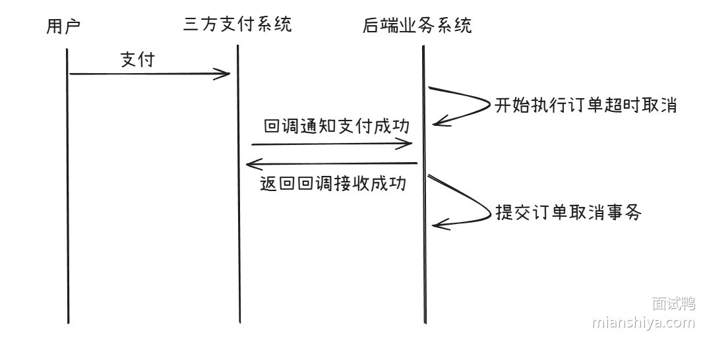
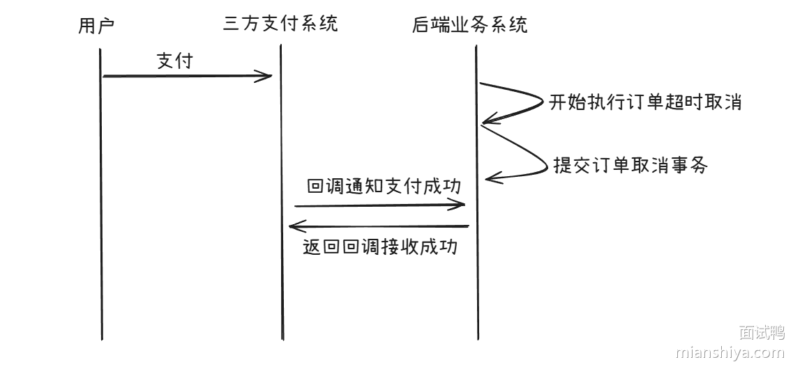

# 场景题

## 1. 不使用 Thread.Sleep() 使得两个线程出现死锁

分析：要使得两个线程出现死锁，就需要两个线程分别各持有一个资源的锁，然后等待另一个资源的锁。而想要两个线程稳定出现死锁，就需要一个方法保证两个线程能够获取到一个资源的锁，然后再获取另一个资源的锁，也就是一个等待同步的机制。

这个机制可以通过 CountDownLatch 来实现，至于锁可以使用 ReentrantLock。

```java
public class Program {  
	// 资源 1
    private final static ReentrantLock lock1 = new ReentrantLock();  
    // 资源 2
    private final static ReentrantLock lock2 = new ReentrantLock();  
    // 控制同步机制
    private final static CountDownLatch latch = new CountDownLatch(2);  
  
    public static void main(String[] args) {  
        Thread t1 = new Thread(() -> {  
            Program.lock1.lock();  
            latch.countDown();  
            try {  
	            // 同步
                latch.await();  
            } catch (InterruptedException e) {  
                throw new RuntimeException(e);  
            }  
            Program.lock2.lock();  
        });  
  
        Thread t2 = new Thread(() -> {  
            Program.lock2.lock();  
            latch.countDown();  
            try {  
	            // 同步
                latch.await();  
            } catch (InterruptedException e) {  
                throw new RuntimeException(e);  
            }  
            Program.lock1.lock();  
        });  
  
        t1.start();  
        t2.start();  
        try {  
            t1.join();  
        } catch (InterruptedException e) {  
            throw new RuntimeException(e);  
        }  
    }  
}
```

## 2. 一个单体项目的 QPS 高达 1 万，需要拆分为微服务吗

分析：一个项目如果要拆分为微服务，并不是看它的 QPS ，而是看业务是否出现瓶颈以及需求，如果出现以下的情况，则可以考虑拆分：

- 模块资源消耗不均匀：某个模块消耗整个系统 80% 的资源，拖慢整个应用，则可以考虑将这个模块拆分出去
- 代码库庞大，开发效率下降：代码库过大，导致开发效率下降，维护困难，则可以考虑拆分
- 故障隔离差：一个模块的崩溃会导致整个应用崩溃，则可以考虑拆分
- 升级技术栈：如果某个模型需要替换技术栈 (如从 Java 替换为 Python)，则可以考虑将这个模块拆分出去

单体应用遇到瓶颈，还是首先考虑优化，例如缓存、分库、算法优化等，只有在优化无效的情况下，才考虑拆分为微服务。因为拆分会带来额外的维护成本、测试成本、开发成本。

## 3. 系统每天定时瘫痪，该如何排查

分析：定时瘫痪这个特点可以缩小范围，大部分情况下是一些定时任务或者资源瓶颈导致的，例如：

- 定时任务：定时备份等任务可能导致 CPU 或 I/O 资源占用过高，导致系统瘫痪 (从库备份可以解决)
- 资源周期性耗尽：例如缓存周期性过期
- 外部依赖：第三方周期性定期维护

排查：

1. 查看监控：利用 Grafana、Prometheus 等监控工具查看系统资源使用情况，找出异常的时间点
2. 查看日志：查看数据库、应用服务器等日志，找出异常的错误信息
3. 分析定时任务

## 4. 40 亿个 QQ 号，1G 内存，去重

分析：假设 QQ 号用 int 存储，则 40 亿个 QQ 号需要消耗的内存为，40 * 10^8 * 4B = 16 G，远超 1G 内存限制。此时常用的方法就是分治。

将 QQ 号通过哈希函数映射到 10 个文件中，然后在这 10 个文件中分别去重即可，因为相同的 QQ 号一定会被分到相同的文件中。

## 5. 在 Java 中，如何不使用锁实现一个线程安全的单例？

1. 饿汉式实现

```java
public class Singleton {
	private static final Singleton INSTANCE = new Singleton();
	private Singleton() {
		// 私有构造函数，防止外部实例化
	}
	public static Singleton getInstance() {
		return INSTANCE;
	}
}
```

单例的实例在类加载时会被直接创建，而类加载是线程安全的，所以饿汉式是天然线程安全的。

优点：实现简单

缺点：存在资源浪费，无法防止反射破坏

2. 静态内部类

```java
public class Singleton {
	private Singleton() {
		// 私有构造函数，防止外部实例化
	}

	private static class Holder {
		private static final Singleton INSTANCE = new Singleton();
	}

	public static Singleton getInstance() {
		return Holder.INSTANCE;
	}
}
```

首次调用 `getInstance()` 时，JVM 才会加载 `Holder` 类，并且由于类的加载是线程安全的，所以它也可以保证线程安全。

优点：延迟加载，资源利用率高

缺点：实现稍微复杂，无法防止反射破坏

3. 枚举实现

```java
public enum Singleton {
	INSTANCE;
	public void doSomething() {
		// 实现具体的业务逻辑
	}
}
```

枚举类型在加载时也是线程安全的，并且 JVM 保证每个枚举常量只加载一次。

优点：实现简单，安全性高，可防止反射破化

缺点：无法延迟加载，资源利用率低

4. CAS 实现

```java
public class Singleton {
    private static final AtomicReference<Singleton> INSTANCE = new AtomicReference<>();
    private Singleton() {}
    public static Singleton getInstance() {
        while (true) {
            Singleton instance = INSTANCE.get();
            if (instance != null) return instance;
            instance = new Singleton();
            if (INSTANCE.compareAndSet(null, instance)) {
                return instance;
            }
        }
    }
}
```

通过原子操作类来保证线程安全。

优点：延迟加载，资源利用率高

缺点：while (true) 可能会空转，无法防止反射破坏

## 6. 抢红包功能，如何计算红包金额

1. 普通红包：直接总金额除以红包数量即可
2. 随机红包：随机红包需要满足两个条件，所有红包金额之和等于总金额、单个红包金额不为 0，并且保证先后概率相等

随机红包算法通常采用实时计算 + 二分均值法实现：

每次分配时，计算当前红包的分配上限为

$$
分配上限 = \dfrac{剩余总金额}{剩余红包数} \times 2
$$

## 7. CPU (业务) 占用高，如何排查

1. 寻找 CPU 占用高的进程，使用 `top` 命令
2. 确认是 Java 进程占用 CPU 高，然后确定是哪个线程，使用 `top -Hp` 命令
3. 使用 `jstack [进程] | grep [十六进制线程 ID -A 100]` 命令查看栈信息

## 8. CPU 负载高，如何排查

### CPU 负载 (Load) 和 CPU 占用 (Utilization) 的区别

CPU 占用表示在某个时间点，CPU 用于处理任务的时间在总时间中所占的比例。50 % 表示 CPU 有一半的时间在处理任务。

CPU 负载表示在特定时间段内（通常是过去 1 分钟、5 分钟、15 分钟）**正在运行** 和 **等待 CPU 资源** (在运行队列中) 的平均进程数量。例如，在一个四核 CPU 上，如果 CPU 负载为 4.0，则说明 CPU 处于满负载状态。CPU 负载小于 CPU 核数，说明 CPU 有空闲资源；大于 CPU 核数，说明 CPU 处于过载状态，等待队列中仍有任务；等于 CPU 核数，说明 CPU 被充分利用，没有等待队列。

CPU 使用率高不等于 CPU 负载高，但是 CPU 负载高通常意味着 CPU 使用率也高。

### 排查步骤

1. 使用 `top` 指令查看负载 (Load) 值，并观察 CPU 使用率
2. 用 `top -Hp` 或者 `ps` 命令查看问题线程
3. 用 `jstack` 查看 Java 程序、`gdb -p` 查看 C/C++ 程序

## 9. 系统上线后，发现某个接口响应很慢，如何定位可能的原因？

通常的解决方案是：分层排查 + 指标监控

1. 确定接口的总耗时，确定耗时大头的位置：使用性能检测工具，拆解各个环节的耗时 (如数据库、缓存、网络等)
2. 应用层排查：使用 Arthas 等工具查看代码执行链路，检查是否存在重复计算，锁竞争等情况
3. 数据库排查：检查慢 SQL 日志，使用 `EXPLAIN` 分析 SQL 执行计划，检查索引是否合理
4. 外部依赖排查：检查第三方服务耗时

## 10. 如何实现敏感词过滤？

敏感词过滤通常有以下几种方式：

1. 最简单的方式：字符串匹配，使用 `String.contains()` 或者正则表达式进行匹配，适用于文本较少的情况
2. 最常见的方式：字典树 + 确定性有限状态机 (DFA)，字典树用于存储敏感词，DFA 用于匹配文本

## 11. 500G 文件需要排序，如何用 4G 内存实现？

分析：500G 文件无法全部放入内存中，所以需要先进行分块，将小块数据进行内部排序得到有序的小文件，然后外部排序，将小文件合并成为大文件

步骤如下：

1. 将大文件分块
	1. 读取数据块
	2. 使用快速排序或者其他排序算法进行内部排序
	3. 将排序后的数据块写入磁盘
2. 多路归并 (堆实现)
	1. 从 N 个有序文件中读取数据到缓冲区
	2. 使用最小堆选举出最小值，写入输出缓冲区
	3. 重复上述步骤，直到所有文件都被读取完毕

## 12. 如果需要存储 IP 地址，数据库中该如何设计类型？

IP 地址通常有两种格式：IPv4 和 IPv6。

对于 IPv4 类型，优先使用**无符号整型**，原因有两个：

1. IPv4 地址刚好可以用 32 位来表示，比字符串存储更节约空间
2. MySQL 提供了 `INET_ATON()` 和 `INET_NTOA()` 函数，可以方便地进行转换

对于 IPv6 类型，优先使用二进制类型 (BINARY(16)) 或者字符串类型 (VARCHAR(16))，次选定长字符串，原因如下：

1. IPv6 地址为 128 位，如果用字符串存储则需要 39 个字符 (包括冒号)，如果用二进制存储则需要 16 个字节
2. MySQL 提供了 `INET6_ATON()` 和 `INET6_NTOA()` 函数，可以方便地进行转换

## 13. 一笔订单，顾客在取消的那一刻付款，该怎么办？

分析：当顾客支付和取消订单发生在同一时刻时，系统的最终状态可能会不一致，处理不当会给顾客和商家都带来困扰。

用户支付成功，但在商家确认之前取消订单，商家可能会认为订单未支付，从而导致商家无法发货。





常见的解决方案有两种：

1. 状态机：在数据库中有 `status` 字段用于表示订单的状态，例如 `paying` 表示支付中，`cancelled` 表示取消支付，`paid` 表示支付成功。在数据库中进行修改时，把状态字段也带上：

```sql
Update pay_info Set status = "paid" Where order_id = 1 and status = "paying";
```

如果状态不匹配，则说明订单已经被取消，支付失败，或者已经支付成功，无法取消订单。

2. 分布式锁

