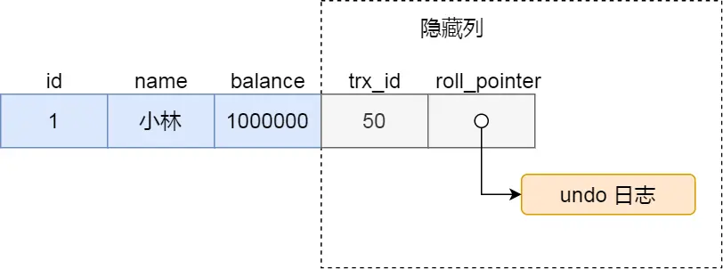

# 数据库

## 0. 目录

[TOC]

## 1. 最左匹配原则

在使用联合索引时，查询条件必须从索引的最左侧开始匹配，也就是查询条件必须包含索引第一个列，其次第二个列，以此类推。

在联合索引中，只有第一个列是全局有序的，其他的列都是局内有序。假设对于联合索引 `(a, b, c)`

- `where a = 1`
- `where a = 1 And b = 2`
- `where a = 1 And b = 2 And c = 4`

上面三个查询都能很好地利用到索引，而

- `where b = 1`
- `where b = 1 And c = 2`

上面查询则无法利用到联合索引，对于

- `where a = 1 And c = 2`

可以部分利用到索引，在 `MySQL 5.6` 版本之后，对于这个查询语句也会用到[索引下推](#^97fe69)优化。

> 假设对于联合索引 `(sex, b)`，其中 `sex` 的取值只有 `1` 和 `0` 两种取值，那么对于查询语句：
> `where b = 1`，也是可以利用上索引的，优化器会优化为 `where sex = 1 and b = 1` 以及 `where sex = 0 and b = 1` 这两条语句

## 2. 脏读、不可重复读和幻读

^aeb352

- 脏读

一个事务读取到另一个事务未提交的数据，如果这个未提交的事务最终被回滚，那么第一个事务读取到的数据就是不一致的。

- 不可重复读

在同一个事务中，先后两次读取同一条数据，但是由于其他事务的提交，导致这两次读取的结果不同。

- 幻读

在同一事务中，执行相同的查询操作，返回的结果集由于其他事务的插入而发生变化（针对数据集中数据的数量）。例如在同一事务中，第一次查询到 100 条数据，第二次查询到 200 条数据。

### 隔离级别

- 读未提交允许脏读
- 读已提交防止脏读，但是会出现不可重复读 (Oracle 默认)
- 可重复读防止脏读和不可重复读，但是会出现幻读 (MySQL 默认)
- 串行化防止所有问题

## 3. 存储引擎

- `InnoDB`
	支持事务、行级锁和外键。
	提供高并发性能，适用于高负载的 OLTP 应用。
	数据以聚集索引的方式存储，提高检索效率。 

- `MyISAM`
	不支持事务和外键，使用表级锁。
	适合读取多，更新少的场景，例如数据仓库。
	具有较高的读性能和较快的表级锁定。

## 4. 覆盖索引

- 回表
	在数据库中，通常只有主键索引会和数据一起存储，其他的索引则会和主键一起存储。当查询其他索引（二级索引）时，会先查询到主键，然后再根据主键再查一次表去寻找真正需要的字段，这个再一次查表的操作也叫做「回表」。

- 覆盖索引
	覆盖索引可以减少回表的操作，即如果查询的字段就是索引所包含的字段，那么查询索引就够了。

对于联合索引`(a, b, c)` 查询 `select b from xxxtable where c = 2`，这句查询无法用到联合索引，所以也就不是覆盖索引。

## 5. 索引类型

- 按数据结构划分
	- B+ 树索引：MySQL 数据库的默认索引，对范围查询比较友好
	- 哈希索引：等值查询速度极快
	- 倒排索引：根据单词查找文章，
	- R 树索引：为多维空间数据（地理坐标）设计，适用于空间查询
	- 位图索引：适用于处理低基数数据，例如性别
- 物理存储
	- 聚簇索引：索引的叶子节点存储完整的数据信息，在 `InnoDB` 中可以看作是主键索引
	- 非聚簇索引：索引的叶子节点存储 \[索引，主键\] 这两个信息
- 索引性质
	- 主键索引
	- 二级索引
	- 联合索引
	- 唯一索引
	- 全文索引：基于倒排索引实现
	- 空间索引：基于 R 树索引

## 6. 索引下推

^97fe69

索引下推用于减少回表操作的优化技术。它只会应用在联合索引上。
对于联合索引 `(zipcode, lastname, firstname)`，假设有一个查询语句：

```sql
SELECT * FROM people
	WHERE zipcode = `12345`
	AND lastname LIKE `%Jac%`
	AND address LIKE `%Backstreet%`
```

如果没有索引下推，当前的联合索引只会用到 `zipcode` 这个字段，在得到符合 `zipcode = 12345` 的结果集之后，传递给 `server` 层进行过滤。

如果有索引下推，在得到符合 `zipcode = 12345` 的数据之后，会再根据 `lastname LIKE %Jac%` 进行过滤数据，不符合条件的数据不会返回给 `server` 层。

## 7. 聚簇索引和非聚簇索引

- 聚簇索引
	- 叶子节点存储完整的数据
	- 每张表只有一个聚簇索引，通常是主键索引
- 非聚簇索引
	- 叶子节点存储索引和主键
	- 每张表可以有多个非聚簇索引

## 8. 回表

由于非聚簇索引的叶子节点只存储索引和主键，所以在查询非聚簇索引时，必须先查询到主键，然后再根据主键去聚簇索引上查表，这个过程叫做回表。

回表并不仅仅只是需要多查一次，还会带来随机 IO 的问题，随机 IO 的性能远远低于顺序 IO 的性能。所以在设计索引时，应该尽量避免回表操作。同时查询时，也要避免进行 `SELECT *` 操作，应该只查询需要的字段。

随机 IO 是因为查询到的数据在二级索引排列下可能是顺序的，但是在聚簇索引排列下很可能是随机的，所以会导致随机 IO 的问题。

## 9. MySQL 是如何实现事务的

- 锁（行级锁、间隙锁）机制，实现事务的**隔离性**
- Redo Log 日志，记录事务的对数据库的所有操作，当 MySQL 发生崩溃时，通过重放 Redo Log 就可以恢复数据，实现事务的**持久性**
- Undo Log 日志，记录事务的对数据库的所有操作，当事务执行失败时，通过回滚 Undo Log 就可以恢复数据，实现事务的**原子性**
- MVCC （多版本并发控制），满足了非锁定读的要求，避免了锁的竞争，提高了并发性能，实现读已提交和可重复读的隔离级别，实现了事务的**隔离性**
- 原子性、隔离性和持久性共同保证了数据库的**一致性**

## 10. SQL 语句的执行过程

1. 权限校验 （连接器）
2. 查询缓存（在之后被废弃）
3. 语法分析 + 词法分析（分析器）
4. 查询优化，例如调整表连接顺序等（优化器）
5. 执行，根据执行引擎提供的接口进行查询操作（执行器）

## 11. 四种隔离级别是如何实现的

在[脏读、不可重复读和幻读](#^aeb352)中，提到过隔离级别：

- 读未提交：一个事务在还未提交时，它所做的变更可以被其他事务读取到，无法防止脏读。
- 读已提交：一个事务提交之后，它所作的变更才可以被其他事务读取到，可以防止脏读，无法防止不可重复读和幻读。
- 可重复读：一个事务在执行所看到的数据与，一直与这个事务开始时一致，可以防止脏读和不可重复读，无法防止幻读。
- 串行化：所有的事务串行执行，在多个事务在对某条记录进行读写操作时，如果发生了读写冲突，那么后访问事务必须等待前一个事务执行完成。

其中，读未提交和串行化的实现比较简单：

- 读未提交：直接读取最新的数据即可
- 串行化：直接加相应的读写锁即可

对于读已提交和可重复读，则是通过 [Read View](#^6870f0) 配合 [MVCC](#^mvcc) 来实现的。

- 读已提交：在每个事务中的每个语句执行前都创建一个 `Read View`，根据当前的 `Read View` 配合 `MVCC` 来读取记录就能做到读已提交隔离级别
- 可重复读：在事务开启时创建一个 `Read View`，之后的每个语句都使用这个 `Read View`，根据当前的 `Read View` 配合 `MVCC` 来读取记录就能做到可重复读隔离级别

## 12. Read View

^6870f0

`Read View` 可以理解为一个数据快照就像相机拍照那样，定格某一时刻的风景。其中有四个重要的字段：


- `creator_trx_id`：创建当前 `Read View` 的事务的事务 `id`
- `m_ids`：创建当前 `Read View` 时，当前数据库中所有的「活跃且未提交」的事务的事务 `id` 列表
- `min_trx_id`：创建当前 `Read View` 时，当前数据库中「活跃且未提交」的事务中最小的事务 `id`
- `max_trx_id`：创建 `Read View` 时，当前数据库中应该给下一个事务的 `id` 值

对于一个事务 `id`，如果 $id < min\_trx\_id$，那么说明在创建该 `Read View` 时这个事务已经提交了。

对于一个事务 `id`，如果 $id > max\_trx\_id$，那么说明在创建该 `Read View` 时这个事务还没有开始。

对于一个事务 `id`，如果 $min\_trx\_id \le id \lt max\_trx\_id \ \ 并且 \ \ id \in m\_ids$，那么说明在创建该 `Read View` 时这个事务是活跃的。

对于一个事务 `id`，如果 $min\_trx\_id \le id \lt max\_trx\_id, \ \ 并且 \ \ id \notin m\_ids$，那么说明在创建该 `Read View` 时这个事务已经提交了。

## 13.  MVCC

^mvcc

`MVCC` 是 `InnoDB` 存储引擎实现的多版本并发控制，主要是通过 `Undo Log` 和 [Read View](#^6870f0) 来实现的。

对于使用 `InnoDB` 存储引擎的数据库表，它的聚簇索引中都包含有两个隐藏字段：

- `trx_id`：当一个事务对某条数据进行改动，就会把这个事务的 `id` 写入到这个字段中。
- `roll_pointer`：每次对某条数据进行改动时，就会把旧版本的记录写入到 `undo log` 中，并把这个 `undo log` 的指针写入到这个字段中。
 


在创建 `Read View` 时，可以将字段中的 `trx_id` 划分为三种情况：


- `trx_id < min_trx_id`：说明这个事务已经提交了
- `trx_id > max_trx_id`：说明这个事务还没有开始
- `min_trx_id <= trx_id < max_trx_id`：说明这个事务是活跃的

当一个事务去查询记录时，根据 `trx_id` 有以下几种情况：

- `trx_id < min_trx_id`：说明这个版本的记录是在创建 `Read View` 就已经提交的事务生成的，所以这个版本的记录对于当前的事务可见。
- `trx_id > max_trx_id`：说明这个版本的记录是在创建 `Read View` 之后才启动的事务提交的，所以这个版本的记录对于当前的事务不可见。
- `min_trx_id <= trx_id < max_trx_id`：此时需要判断 `trx_id` 是否存在于 `m_ids` 列表中
	- 如果存在，说明生成该版本的记录的事务仍然活跃（还没有提交，如果读取会发生脏读），所以该版本的记录对于当前事务不可见
	- 如果不存在，说明生成该版本的记录的事务已经提交了，所以该版本的记录对于当前事务可见

以上的这种通过「版本链」来控制并发事务对同一条记录的行为叫做 `MVCC`，灵活地应用 `MVCC` 就可以实现 读已提交和可重复读的隔离级别。

## 14. 深度分页

深度分页是指在数据库查询中，当你需要获取**非常靠后的数据页**时遇到的性能问题。举个例子，假设你有一个包含 100 万条用户记录的表，你想要获取第 10000 页的用户数据，每页显示 10 条记录。这意味着你需要跳过前面的 9999 页，也就是 99990 条记录，然后获取接下来的 10 条记录。

```sql
SELECT * FROM users LIMIT 10 OFFSET 99990;
```

当 Offset 很大时，MySQL 会从头开始扫描表，跳过前面的 99990 条记录，这个过程非常耗时，尤其是当表的记录数非常多时。

为了解决这个问题，可以考虑以下几种优化方法：

1. 基于上一次查询的最后一条记录进行分页。这种方法只适合连续查询的情况，如果用户直接从第一页跳转到第 10000 页，就无法使用这种方法。
	在查询第 `x` 页时，记录这一页最大的 `maxId`，下次查询第 `x + 1` 页时利用这个 `id` 进行索引查询：
	`SELECT * FROM users WHERE id > maxId LIMIT 10`
2. 子查询优化，首先通过子查询查到需要数据的 `id`，然后再根据 `id` 去查询到全部需要的数据。

	```sql
	SELECT * FROM users as t1 JOIN (
		SELECT id FROM users ORDER BY some_column LIMIT 1 OFFSET 99990
	) AS t2 ON t1.id = t2.id;
	```
	
	子查询由于只需要获取到 `id` 字段，并且或许还可以利用到 `some_column` 的索引，所以性能会比 `SELECT *` 要好很多。

## 15. MySQL 主从同步机制

### 什么是主从同步

主从同步是指将主数据库中的数据同步到从数据库中，以实现数据的备份和负载均衡。它允许将一个 MySQL 数据库服务器（主库 Master）的数据实时或准实时地复制到另一个或多个 MySQL 数据库服务器（从库 Slave）上。

### 为什么需要主从同步

- 数据备份：主从同步可以实现数据的备份和恢复，防止数据丢失。
- 负载均衡：主从同步可以将读操作分散到多个从库上，提高系统的性能和可用性。
- 高可用性：主从同步可以实现高可用性，当主库出现故障时，可以快速切换到从库，保证系统的正常运行。
- 数据分析：从库可以用于数据分析和报表生成，减轻主库的负担。

### 主从同步的实现原理

主从同步主要是依赖于三个线程：

- 主库的 `Binlog Dump` 线程，当主库的 `Binlog` 日志发生变化时，`Binlog Dump` 线程会将变化的数据发送给从库。
- 从库的 `IO` 线程，负责接收主库发送过来的 `Binlog` 日志，并将其写入到本地的 `Relay Log` 日志中。
- 从库的 `SQL` 线程，负责读取本地的 `Relay Log` 日志，并将其执行到从库中。

### 主从同步的三种模式

- 异步复制：主库将数据写入 `Binlog` 日志后立即返回，不等待从库的确认。优点是性能高，缺点是数据一致性差，可能会丢失数据。
- 半同步复制：主库将数据写入 `Binlog` 日志后，等待至少一个从库的确认后才返回。优点是性能和数据一致性都较好，缺点是性能稍低。
- 全同步复制：主库将数据写入 `Binlog` 日志后，等待所有从库的确认后才返回。优点是数据一致性高，缺点是性能低。

## 16. Change Buffer

ChangeBuffer 主要用于缓存对**二级索引页**的修改操作，当这些索引页不在内存（Buffer Pool）中时，避免立即进行昂贵的随机磁盘 I/O 操作。

在对表进行 UPDATE、INSERT、DELETE 操作时，可能会涉及到索引的修改，而针对于索引页的修改通常是随机 IO 的。此时需要先从磁盘读取索引页面，然后修改，再写回磁盘。这个过程的开销非常大。

将针对于二级索引页的修改操作暂存到 ChangeBuffer 中，可以把随机 IO 转换为顺序 IO，可以提高性能。

---

## Ex 1. 分库和分表

分库：

- 垂直分库：按照业务功能划分，例如用户库、订单库等
- 水平分库：将原来的表数据分散到库中，例如 `0 <= id < 100 万` 的数据放在 `db1` 中，`100 万 <= id < 200 万` 的数据放在 `db2` 中

分表：

- 垂直分表：当一个表太宽的时候，把它拆分成多个表，例如把用户表拆分为用户基本信息表、用户详细信息表等
- 水平分表：
	- 按照范围分表，例如 `0 <= id < 100 万` 的数据放在 `table1` 中，`100 万 <= id < 200 万` 的数据放在 `table2` 中
	- 按照哈希值分表，例如 `id % 4 = 0` 的数据放在 `table1` 中，`id % 4 = 1` 的数据放在 `table2` 中
	- 按照时间分表，例如把每个月的数据放在一个表中

### 需要注意的问题

1. 分布式事务
	- 分库分表后，一个事务可能跨越多个数据库，此时需要保证这些操作的原子性将会非常困难，需要使用分布式事务
2. 联合查询
	- 分库分表后，使用 `Join` 操作会非常麻烦，因为可能需要跨库查询，需要引入其他中间件或者在代码中进行处理
3. 排序和分页
	- 分库分表后，排序和分页会变得复杂
4. ID 自增和唯一性
	- 分库分表后，如何保证唯一性 ID 不重复是一个挑战

## Ex.2 二阶段提交

MySQL 中通过二阶段提交来保证 Binlog 和 Redolog 之间的一致性。二阶段的详细步骤如下：

### 第一阶段：Prepare 阶段

1. 写入 Redolog：将事务的所有变更写入 Redolog Buffer 中
2. 持久化 Redolog：将 Redolog Buffer 中的数据写入磁盘 (调用 `fsync()` )
3. 标记为 Prepare 状态：将事务状态标记为 Prepare，表示事务已经准备好提交，但尚未提交

### 第二阶段：Commit 阶段

1. 写入 Binlog：将事务的 SQL 语句写入 Binlog 中
2. 持久化 Binlog：将 Binlog Buffer 中的数据写入磁盘 (调用 `fsync()` )
3. 提交事务：将事务状态标记为 Commit，表示事务已经提交成功

如果在中途发生断点，首先检查 Redolog 中的状态是否是 Prepare，如果不是则回滚；如果是，则检查 Binlog 是否完整，如果 Binlog 完整，则将状态修改为 Commit，否则回滚。