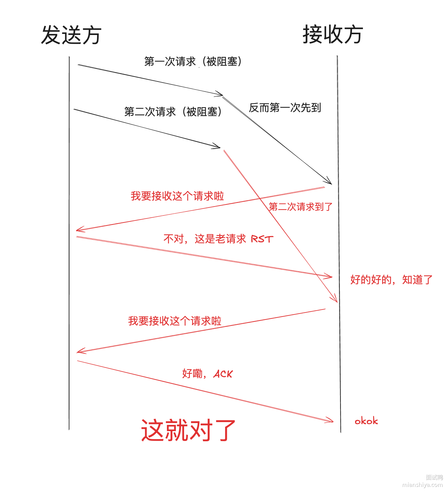
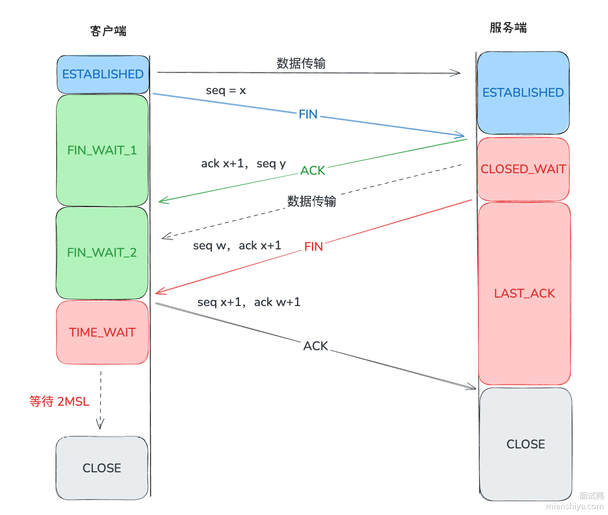
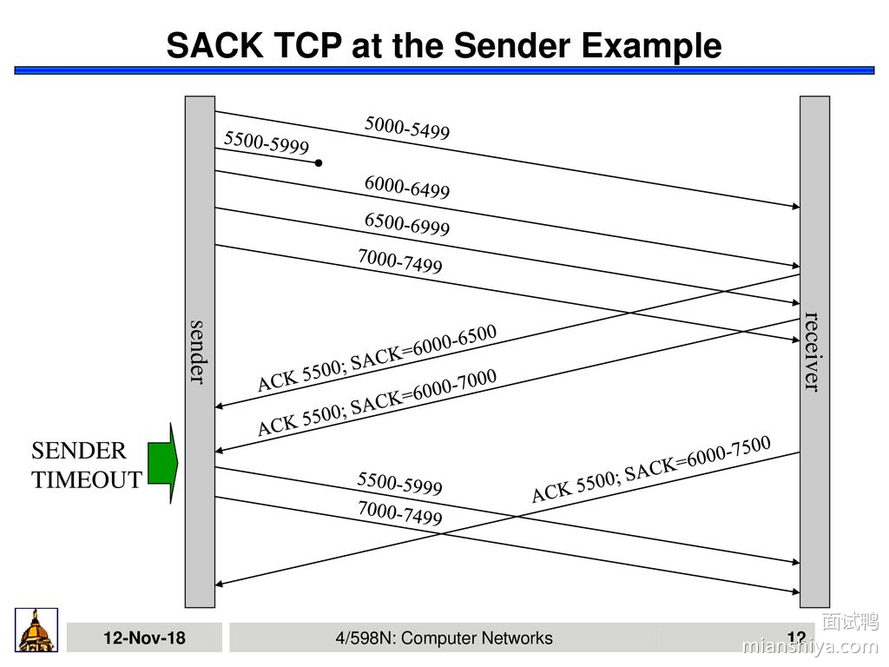
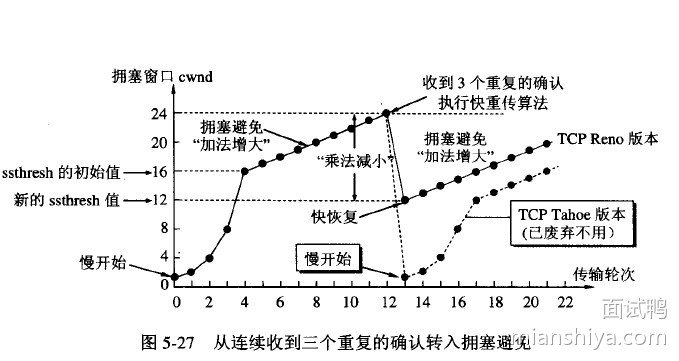

# 计算机网络

## 1. HTTP 各版本

### HTTP 1.0 特点

1. 短连接，每次发送 HTTP 请求时，都需要进行 TCP 三次握手，建立 TCP 连接
2. 引入了 Content-Type，使得可以传输多种类型的数据

### HTTP 1.1 特点

1. 长连接，Connection: keep-alive，只要任意一段没有明确关闭连接，连接就会保持
2. 管道传输，无需等待前面请求的响应，就可以发送后面的请求 (这个功能在 HTTP 1.1 中是默认关闭的)
	1. 但是服务端必须按照请求的顺序来响应请求
	2. 如果管道中的某个请求耗时长，那么管道后面的请求就会被阻塞，这是「队头阻塞」现象

虽然 HTTP 1.1 看似改进了很多，但是其实 HTTP 1.1 的性能并不高。

### HTTP 2.0 特点

1. 基于 HTTPS 协议，安全性更高
2. 头部压缩，使用 HPACK 算法压缩头部，减少传输的数据量。如果发送的多个请求中，它们的头部是相似的，则会进行头部压缩
3. 二进制数据，HTTP 2.0 全面使用二进制格式，增加传输效率
4. 多路复用，HTTP 2.0 支持多路复用，可以在一个 TCP 连接中同时发送多个请求和响应，解决了 HTTP 1.1 中的队头阻塞问题
	1. 将请求和响应拆分为多个「帧」
	2. 每个帧都有一个流 ID，表示这个帧属于哪个请求和响应
	3. 同一个请求或者响应的帧具有相同的流 ID
	4. 可以按照任意的顺序发送这些帧，接收的时候，按照流 ID 进行组装
	5. 由于 TCP 的特性，还是存在队头阻塞问题，若有一个流中的帧没有接收完整，那么后面的流也会被阻塞
5. 服务器推送，当访问一个网页时，原本需要通过三次请求获取到 HTML、CSS 和 Js 文件，但是通过服务器主动推送，可以只通过一次请求获取 HTML 文件，服务器主动将 CSS 和 Js 文件推送给客户端

### HTTP 3.0 特点

1. 使用 UDP 协议，彻底解决队头阻塞问题
2. QUIC 协议，实现可靠传输，解决 UDP 的不可靠传输问题
3. 快速握手，结合 QUIC 握手和 TLS 握手，减少了握手的时间

HTTP 3.0 普及速度较慢。

### HTTP 请求

HTTP 请求由以下四个部分组成：

- 请求行：包含请求方法、请求路径、HTTP 协议版本号
- 请求头：包含各种键值对
- 空行：分割请求头和请求体
- 请求体：在 POST 和 PUT 方法中，包含请求体数据

请求头类型：

- 通用头部：适用于请求和响应，如 Cache-Control、Connection 等
- 请求头部：特定于请求的头部，如 Host、User-Agent、Accept、Authorization 等
- 实体头部：描述请求体的头部，如 Content-Type、Content-Length

请求体类型：

- 表单数据：application/x-www-form-urlencoded
- 多部分数据：multipart/form-data
- JSON 数据：application/json
- XML 数据：application/xml
- 纯文本数据：text/plain

### HTTP 缓存机制

HTTP 缓存一共有两种，分别是强制缓存和协商缓存

1. 强制缓存

强制缓存是一种无条件的缓存机制。当浏览器检查到某个资源的缓存命中时，如果该资源的缓存仍然有效（未过期），浏览器就会直接从本地缓存中加载该资源，而**不会向服务器发送任何请求**。

它依赖于 HTTP 请求头中的两个字段，`Expires` 和 `Cache-Control`。

- `Expires`：它是一个绝对时间，表示在这个时间之前，浏览器可以使用缓存。
- `Cache-Control`：它是一个相对时间，表示在这个时间之前，浏览器可以使用缓存。

在实践中，更推荐使用 `Cache-Control` 字段，因为它提供更加精细的控制，并且可以避免时区问题。

2. 协商缓存

协商缓存是一种有条件的缓存机制。当浏览器检查到某个资源的缓存命中时，如果该资源的缓存已过期，浏览器就会向服务器发送请求，询问该资源是否有更新。

协商缓存依赖于两对字段：`Last-Modified + If-Modified-Since` 和 `ETag + If-None-Match`。

- `Last-Modified`：表示这个响应资源的最后修改时间
- `If-Modified-Since`：当资源过期了，并且发现响应头中具有 `Last-Modified` 字段时，浏览器会将 `Last-Modified` 的值作为请求头发送给服务器，询问这个资源是否有更新，如果有被更新，则回答 200，并返回最新资源；如果没有更新，则回答 304，表示资源没有更新，浏览器可以使用缓存。
- `ETag`：表示这个响应资源的唯一标识符
- `If-None-Match`：当资源过期了，并且发现响应头中具有 `ETag` 字段时，浏览器会将 `ETag` 的值作为请求头发送给服务器，询问这个资源是否有更新，如果有被更新，则回答 200，并返回最新资源；如果没有更新，则回答 304，表示资源没有更新，浏览器可以使用缓存。

在实践时更加推荐第二种方式，因为可以避免时间被篡改的问题。

### 服务器是如何解析 HTTP 请求数据的

1. 解析请求行
	- 请求行中包含有请求方法、请求路径和 HTTP 版本号
2. 解析请求头，获取请求头中的各种键值对
3. 解析请求体，如果请求方法是 POST 或 PUT，则会解析请求体中的数据。根据 Content-Type 来解析请求体
4. 路由与处理

## 2. TLS 握手

1. 客户端发送 Client Hello，包含支持的加密算法、随机数等
2. 服务器发送 Server Hello，包括自己的证书，加密算法，以及另一个随机数等
3. 客户端验证整数，并生成一个预主密钥，然后使用服务器的公钥加密预主密钥，并发送给服务器，同时使用预主密钥和两个随机数生成主密钥
4. 服务器使用私钥解密预主密钥，并使用两个随机数和预主密钥算出主密钥
5. 双方使用算出来的主密钥进行通信

## 3. TCP 的特点

- 可靠传输：TCP 确保数据包在传输的过程中不会丢失、重复、乱序
- 流量控制：TCP 通过滑动窗口算法来控制数据的发送速度，避免接收端处理不过来
- 拥塞控制：TCP 通过慢启动、拥塞避免、快速重传和快速恢复算法来控制网络的拥塞
- 连接管理：TCP 使用三次握手和四次挥手来建立和关闭连接

## 4. TCP 和 IP

1. IP 协议是什么

IP 协议的主要工作是，在复杂的网络线路中找到一条路，然后把数据包从源头送到目的地。它解决「去哪里」和「怎么去」的问题。

IP 协议的特点是：

- 尽力而为：尽力去送数据包，但是不保证一定送到
- 不保证顺序：收到的顺序与发送的顺序不一定一致
- 不保证完整性：数据包可能会损坏
- 无连接：不需要建立连接，直接发送数据包。相当于寄信前不用先和收信人打招呼，直接寄信

2. 为什么有 TCP

TCP 协议的主要工作是，保证数据包的可靠传输，这是 IP 协议没有解决的事情。

TCP 协议的特点是：

- 可靠传输
- 连接管理
- 流量控制
- 拥塞控制

3. IP 层为什么不集成 TCP

原因如下：

- 设计目标：IP 协议的设计目标是简单而高效，它处于网络的核心位置，如果它负责的东西过多，那么它的复杂性就会增加，导致性能下降
- 端到端：IP 协议只负责把数据包送到目的地，至于数据包的内容是否正确，在 IP 层做会造成很大的开销
- 灵活性：IP 协议的设计目标是灵活性，它可以与任何传输层协议一起工作，比如 TCP、UDP 等

4. 为什么需要 UDP

UDP 在 IP 上做的封装很简单，它的主要功能是为了提供端到端的通信。IP 协议把数据送给目的主机，UDP 协议把数据送给目的主机上的应用程序。

## 5. TCP 三次握手

三次握手流程如下：

1. 客户端发送 SYN 包，TCP 规定，只有在 SYN 包中 ACK 才可以为 0，其他情况下的 ACK 均为 1
2. 服务端收到 SYN 包，发送 ACK 包，确认号为 SYN + ACK
3. 客户端发送 ACK 包

客户端和服务端通过三次握手，确认的各自的收发能力，保证双方都可以接收数据和发送数据，下面是三次握手的一些问题：

- 第三次握手能否传输数据？

可以传输数据，同时会消耗序列号。

- 客户端是不是在发送完第三次握手的 ACK 包之后，就立马开始发送数据了？

是的。

- 如果服务端没有收到第三次握手的 ACK 包，对于客户端之后发送的数据该如何处理？

服务器会把接收到的第一个数据包当作第三次握手的 ACK + 数据包进行处理，因为第三次握手要求携带 ACK，而客户端之后发送的所有数据包也是一定携带了 ACK 的，所以数据包可以直接作为 ACK 包。

- 如果服务端后来又收到了第三次握手的 ACK 包，该如何处理？

会被当作重复的 ACK 包，直接丢弃。

- 为什么是三次握手

有两个主要原因：

1. 避免历史错误连接的建立
2. 帮助双方同步初始化序列号，确定双方的收发能力正常

下面主要说说第一点，首先场景如下：

客户端想要与服务端建立连接，它首先发送了**第一个** SYN 包，但是由于**网络原因**，服务端没有收到这个 SYN 包，也没有给出回应。在经过一段时间后，客户端再次发出了**第二个** SYN 包，这个时候服务器收到并回复了，然后客户端与服务端建立连接，完成通信。又经过了一段时间，在网络中阻塞的第一个 SYN 包也发到了服务器端，

这个时候，如果只有**两次握手**，服务器端就会认为这是一次**新的连接请求**，然后**消耗资源**，建立起连接，直到客户端发现这次连接已经失效并发送 **RST** 给服务器。这无疑会使得服务器白白消耗资源。

如果是三次握手，服务器此时还会发送一个 ACK 给客户端，然后等待客户端的确认才会建立起连接，此时服务器并不会为这个连接消耗资源，因为连接还没有成功建立。

## 6. TCP 四次挥手

前两次挥手：客户端向服务器发送 FIN，服务器发送 ACK。这表示客户端已经结束了数据的发送，之后再没有数据发送了。但是服务器可能还有数据没有发送完。

后两次挥手：服务器向客户端发送 FIN，客户端发送 ACK。这表示服务器的数据已经发送完成，之后也没有数据发送了，此时连接关闭。

如果服务器本身就没有数据发送，那么第二次挥手和第三次挥手可以合并成一次挥手。

### 6.1 为什么需要有 TIME_WAIT 以及 2 MSL

主要有两个原因：

1. 保证最后的 ACK 能被对方收到

最后的 ACK 也有可能会在网络中丢失，如果对方迟迟没有收到 ACK，则会在 1 MSL 后重新发送 FIN 包，而 FIN 包传过来最多需要 1 MSL 时间，所以等待 2 MSL 如果没有收到 FIN 包，则大概率是对方已经关闭连接了。

> 小概率情况下，重传的 FIN 也阻塞在网络中了，此时接收端单方面关闭连接；发送方还会继续尝试重传 FIN 包，在重传一定次数之后，也会放弃，并关闭连接。

2. 防止失效连接的报文段干扰新的连接

如果没有 TIME_WAIT，那么在关闭连接后，可能会有一些报文段在网络中滞留。如果在关闭后立刻就有新的连接使用端口，那么上一个连接中的报文段此时如果被新的连接接收到了，那么就会造成数据混乱。等待 2 MSL 可以保证这些报文段一定都被销毁了。

## 7. TCP 超时重传机制

TCP 超时重传机制是 TCP 协议中用于保证数据可靠传输的重要机制之一。它的基本原理是：在发送数据时，TCP 会启动一个定时器，如果在规定的时间内没有收到对方的确认 ACK，则认为数据包丢失，重新发送数据包。

那么该如何确认到底超时多久才重传呢？

通常是根据往返时间 RTT 来进行计算的，而往返时间则是根据采样得到的。

## 8. RST 报文

RST 报文是一种强制终止连接的标志。主要出现一下几种情况时，会发送 RST 报文：

- 端口未监听：主机在一个没有被监听的端口上收到了数据包，会回复一个 RST 报文
- 连接异常关闭：如果一方出现崩溃、强制退出等情况，TCP 会使用 RST 报文来终止连接
- 收到范围之外的数据包：如果某一方接收到了一个预期范围外的数据包时，会回复一个 RST 报文
- 无效连接：当主机收到与当前连接状态不符的请求时，会回复一个 RST 报文 (例如还未建立连接就收到 FIN 报文)

## 9. SACK 机制

TCP 采取**累计确认**机制。如果接收方收到了 ACK = x 的确认报文，那么说明对于 x 之前的报文都已经成功收到。累计确认的优点在于，如果中间有 ACK 丢失了，只要收到了后续的 ACK 接收方也能知道丢失 ACK 的那个报文也被成功接收了。

累计确认的缺点在于，如果中间有一个报文丢失，那么接收方即使接收到后面的报文，也会发送丢失报文的 ACK。接收方累计收到 3 次重复 ACK 之后或者超时之后，就会进行重传。这有可能导致丢失报文和后面的报文都需要进行重传 (Go Back N)。

SACK 选择确认机制就是为了缓解累计确认的缺点。它使得发送方只用传输丢失的报文段，而不用重传丢失报文段后面的其他报文。

## 10. TCP 拥塞控制

- 慢开始
	- 在连接建立初期，缓慢地增加数据发送速率，初始的窗口长度为 1 MSS，每次收到一个 ACK，就将窗口长度加倍，直到达到慢启动阈值或者拥塞发生
- 拥塞避免
	- 到达阈值后，窗口长度每次 (每个 RTT) 增加 1 MSS，也就是每个 ACK 会使得窗口增加 (cwnd += 1 / cwnd)，直到发生拥塞
- 快速重传
	- 收到 3 个重复 ACK 时，立刻重传
- 快速恢复
	- 快速重传后，阈值设置为当前窗口的一半，然后当前窗口长度 cwnd = 阈值 + 3，如果再收到重复的 ACK，则 cwnd + 1，如果收到新的 ACK，则进入拥塞避免阶段

在拥塞避免阶段，如果遇到超时重传，则 cwnd = 1，并进入慢启动阶段